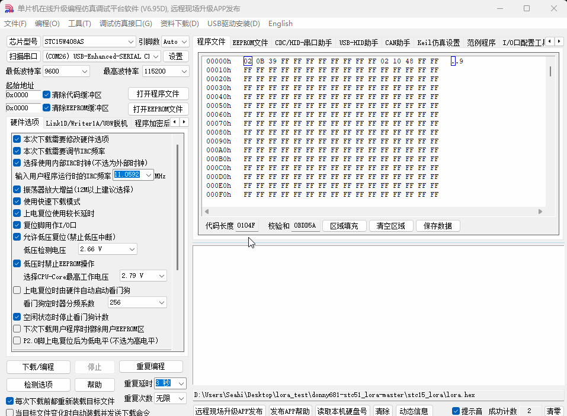

<!-- 封面 -->


## 简介

**STLink343** 是一款基于 STM32F103CBT6 核心打造的高性能 ST-Link/V2 调试工具，**`同时集成 USB 转 TTL 串口调试功能`**，两个功能无任何冲突，可实现双工具同时工作，大幅提升开发调试效率。<br>
**其核心优势如下：**<br>
- 原生支持 **`SWD 调试接口`**，精准适配 STM32 等主流芯片的在线调试与程序下载需求
- 集成高速 **`USB 转串口功能`**，最高波特率可达 6000000 bps，满足大流量数据传输与日志打印需求
- 支持 USB 接口飞线通讯，无需额外转接，即可便捷对接各类 USB 设备开展调试工作
- 配备一键冷启动功能，针对 **`C51 单片机`** 开发场景，无需反复插拔下载线，显著提升开发效率
- 全面兼容 **`ESP 系列`** 芯片，以及 Ai-WB2、Ai-M61 等 WiFi 模组，轻松实现程序下载与实时日志查看
- 采用 **`Type-C + USB-A 双接口设计`**，可根据实际使用场景灵活选择，适配不同设备的连接需求
- 提供 **`5V/3.3V`** 双路电源输出，一站式满足不同电压规格硬件的供电需求
- 输出电源内置防反接、防短路、过流三重保护机制，为调试设备与工具本身提供可靠安全保障

## 引脚图

<center>


</center>

::: warning USB-A 和 Type-C 只能二选一，图中只能做参考。
:::
## 尺寸图


## C51 一键下载


::: note 先接把 STLink343 与 C51 开发板的串口线短接起来，再插入电脑。连接方法：
- STLink343 TXD —— C51 开发板 RXD
- STLink343 RXD —— C51 开发板 TXD
- STLink343 GND —— C51 开发板 GND
- STLink343 5V —— C51 开发板 VCC
:::

1. 点击下方连接，下载软件 STC-ISP(如已下载请忽略):

::: shareCard
```yaml
- name: 点击下载 STC-ISP V6.95D
  desc: STC 系列单片机烧录程序
  avatar: ./IMG/STC-ISP.png
  link: https://stcmicro.com/rar/stc-isp6.95d.rar
  bgColor: "#57abfa"
  textColor: "#f0dfe4"
```
:::

2. 选择串口,串口名：USB-Enhanced-SERIAL CH343
3. 选择单片机型号
4. 选择需要烧录的 `.hex` 文件
5. 点击下载
6. 按一下 `一键冷启动键` 即可进入烧录
7. 烧录成功如下所示：
<center></img></center>

## 更多资料

::: navCard

```yaml
config:
    target: _self

data:
  - name: 自定义配置
    desc: 切换冷启动按键控制输出的电源
    img: /costom.png
    link: /user/user_custom
    badgeType: tip
    badge: 使用教程

```

:::