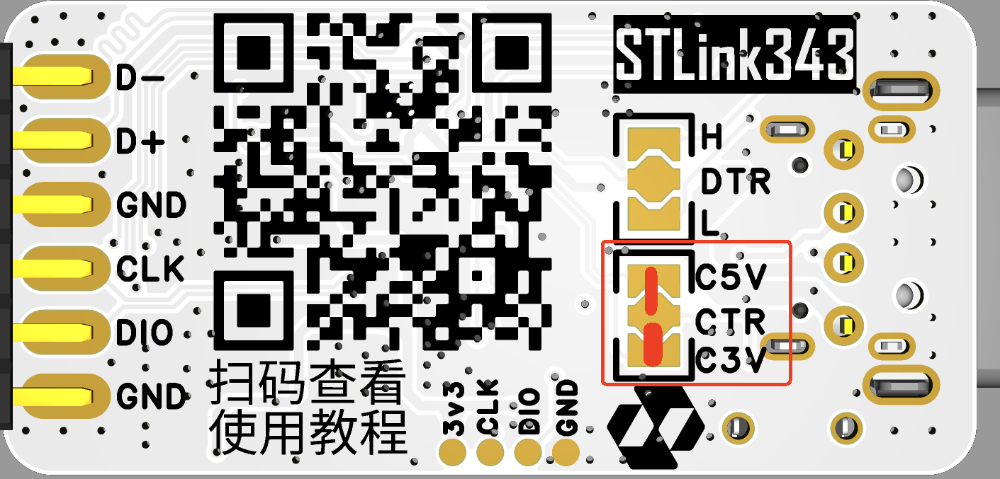
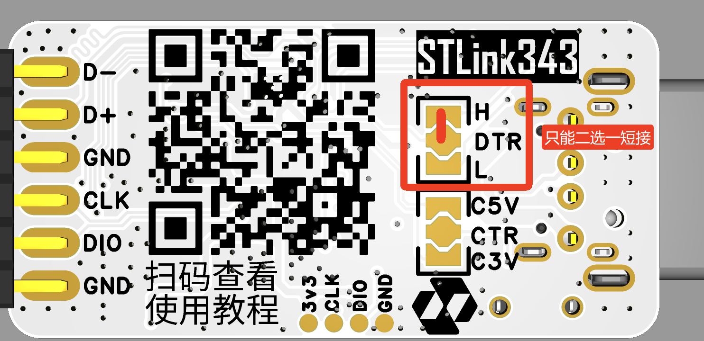

## 冷启动控制

一键冷启动控制功能支持自定义配置，可实现 **`5V/3.3V 双电压电源输出的使能管控`**，逻辑如下：
按键按下：切断电源输出
按键松开：恢复电源输出

### 更改控制的电源（默认5V）

::: note 需要具备以下条件才能更改：
- 电烙铁 x1
- 焊锡丝
- 熟练使用电烙铁
:::

**更改方法** 
如下图所示，通过 **`CTR`** 焊盘即可灵活控制电源输出：短接上下焊盘可单独开关 5V 或 3.3V 输出；**同时短接两组焊盘**，即可实现 5V 和 3.3V 输出的同步控制。

</img>

## DTR 电平输出控制（默认高电平）

::: note STLink 343 的 TTL 芯片型号为 CH343P，上电后 DTR 默认输出`高电平`，当串口调试助手勾选 `DTR` 功能后，DTR 引脚输出 `低电平`。STLink 343 的 DTR 电平控制指的是 **串口调试助手勾选 `DTR`** 后输出的电平。
:::

如下图所示，通过 **`DTR`** 焊盘即可灵活选择 TTL 芯片 DTR 输出的电平高低，只需短接上下焊盘 `H` 或 `L`；

</img>
