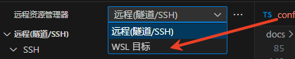

## VS Code 安装步骤 {#install_VScode1}

### 下载 VS Code

- 访问官方网站：[https://code.visualstudio.com/](https://code.visualstudio.com/)
- 根据操作系统（Windows/macOS/Linux）选择对应版本下载：
	- **`Windows`**：选择 `“Windows”` 版本，下载`.exe` 安装文件
    - **`macOS`**：选择 `“macOS”` 版本，下载`.dmg` 镜像文件
    - **`Linux`**：根据发行版选择`.deb（Debian/Ubuntu）`或`.rpm（CentOS/RHEL）`版本，或下载`.tar.gz` 压缩包

### 安装过程

#### Windows 系统

- 双击运行下载的.exe 文件，进入安装向导
- 勾选 `“接受许可协议”`，点击 “下一步”
- 选择安装路径（建议默认路径，或自定义非中文路径）
- **关键步骤**：在 `“选择附加任务”` 中，务必勾选以下选项：
  - ✅ 添加到 PATH（方便终端调用 code 命令）
  - ✅ 创建桌面快捷方式
  - ✅ 关联文件类型（可选，建议勾选.cpp/.c 文件）
- 点击 `“安装”`，等待安装完成后点击 `“完成”`

#### macOS 系统

- 双击下载的`.dmg` 文件，将 VS Code 图标拖入 `“Applications”` 文件夹

- 打开 `“启动台”`，找到 VS Code 并点击启动（首次启动可能需要授权，按提示操作即可）
<!-- 
#### 🔹Linux 系统（以 Ubuntu 为例）

1.  打开终端，进入下载目录

2.  执行命令安装.deb 文件：
	```bash
	sudo dpkg -i code_*.deb
    ```
3.  若出现依赖问题，执行修复命令：

	```bash
	sudo apt-get install -f
	```
4.  安装完成后，在应用菜单中找到 `“Visual Studio Code”` 启动 -->

### 首次启动配置

- 打开 VS Code，欢迎界面会显示 `“自定义”` 选项

- 选择主题：点击 `“颜色主题”`，推荐选择 `“Dark`+`(默认深色)”`（对眼睛更友好，代码对比度高）

- 可选择安装默认推荐插件（暂不安装，后续针对性配置 C 语言相关插件）

## C 语言开发必备插件

打开 VS Code，点击左侧菜单栏的**扩展图标**（或按快捷键 `Ctrl+Shift+X`），在搜索框中输入插件名称，找到对应插件后点击 “安装”。

### 推荐插件

| 插件名称                     | 开发者       | 核心功能                                        |
| ------------------------ | --------- | ------------------------------------------- |
| **C/C++**                | Microsoft | 官方核心插件，提供 C/C++ 语法高亮、智能提示、代码格式化、调试支持        |
| **C/C++ Extension Pack** | Microsoft | 插件集合，包含 C/C++、CMake Tools 等，一键安装所有基础工具，避免遗漏 |
| **Code Runner**          | Jun Han   | 一键运行代码，支持 C/C++ 等多种语言，无需手动输入编译命令            |
| **Doxygen Documentation Generator**| Marat Dulin | 生成 Doxygen 文档，方便代码注释和 API 文档生成          |
| **vscode-icons**        | vscode-icons-team | 提供丰富的图标，使文件树更美观，方便识别文件类型              |
| **Serial Monitor**      | Mads Kristensen   | 串口调试工具，方便调试嵌入式系统、单片机等               |
| **CMake Tools**         | Microsoft | 自动识别 CMakeLists.txt，提供构建 / 调试一体化支持          |

### 可选增强插件


- **GitLens**：增强 Git 集成，显示代码提交历史、作者信息，方便多人协作开发

- **Better Comments**：优化注释显示，支持按不同类型（警告、TODO、说明）给注释添加颜色标记

## SSH 远程连接配置（远程开发 C 语言）

### 安装 SSH 插件

在扩展商店搜索 **Remote - SSH**（由 Microsoft 开发），点击 “安装”。安装完成后，左侧菜单栏会新增 “远程资源管理器” 图标（类似显示器的图标）。

### 配置 SSH 连接信息

#### 步骤 1：打开 SSH 配置文件

- 点击左侧 `“远程资源管理器”` 图标
- 在 `“SSH Targets”` 下方，点击 `“配置”` 图标（齿轮形状）
- 选择 SSH 配置文件路径：
  -  **`Windows`**：`C:\Users\你的用户名\.ssh\config`
  -  **`macOS/Linux`**：`~/.ssh/config`（若不存在则自动创建）

#### 步骤 2：编写配置内容

在配置文件中添加远程服务器信息，格式如下（按实际情况修改）：

``` bash
# 自定义主机名（方便记忆，如“linux-server”）

Host linux-server

# 远程服务器的IP地址或域名（如192.168.1.100）

HostName 192.168.1.100
# 远程服务器的登录用户名（如ubuntu、root）,用户名一定是实际定义的用户名，不一定是 ubuntu
User ubuntu

# SSH端口号（默认22，若服务器修改过端口则填写实际端口）
Port 22

```

保存配置文件（`Ctrl+S`）。

### 连接远程服务器

#### 步骤 1：发起连接

- 在 `“远程资源管理器”` 的 `“SSH Targets” `列表中，找到刚才配置的主机名（如 `“linux-server”`）

- 右键点击主机名，选择以下任一选项：

  - `“Connect to Host in Current Window”`：在当前窗口连接（关闭本地项目）
  -  `“Connect to Host in New Window”`：在新窗口连接（保留本地项目，推荐）

#### 步骤 2：验证身份

- 首次连接会提示 `“选择平台”`，根据远程服务器系统选择（如 `“Linux”`）
- 输入远程服务器的登录密码（输入时终端不显示字符，输完按回车即可）
- 若提示 `“是否信任此主机”`，输入 `“yes”` 并回车，完成连接

### 远程服务器配置 C 语言环境

连接成功后，VS Code 会显示 `“远程”` 标识（窗口左下角有 `“SSH: 主机名”`）。此时需在远程服务器安装 C 语言编译器：
::: tip 可以把本地安装的插件都在远程服务器上安装一遍，这样就可以在本地和远程服务器之间切换了
:::
#### Ubuntu/Debian 系统

打开 VS Code 内置终端（`Ctrl+`），执行命令：

```bash
sudo apt update && sudo apt install -y gcc g++ gdb
```

（`gcc`是 C 编译器，`g++`是 C++ 编译器，`gdb`是调试工具）

#### CentOS/RHEL 系统

执行命令：

```bash
sudo yum install -y gcc gcc-c++ gdb
```

#### 验证安装

执行命令 `gcc --version`，若显示版本信息（如 “gcc (Ubuntu 9.4.0-1ubuntu1\~20.04.1) 9.4.0”），则说明安装成功。

## 连接 WSL
### 安装 WSL，请参考:[WSL 安装](/tutorial/Linux/wsl_install)
### 安装 WSL 的Ubuntu,请参考：[Ubuntu 安装——WSL安装章节](/tutorial/Linux/ubuntu_install#wsl安装-ubuntu)
### 安装 WSL插件

在扩展商店搜索 **WSL**（由 Microsoft 开发），点击 “安装”。安装完成后，左侧菜单栏会新增 “远程资源管理器” 图标（类似显示器的图标）。
<center>


</center>

### 连接 WSL
#### 发起连接
1.  在 `“远程资源管理器”` 的 `“WSL Targets” `列表中，找到 WSL 发行版名称（如 `“Ubuntu-20.04”`）

2.  右键点击发行版名称，选择以下任一选项：

- `在当前窗口连接`
- `在新窗口连接`

::: tip 首次连接VSCode 会在WSL中下载VSCode服务器，请耐心等待安装完成。连接完成进行正常的配置即可。
::: 

<!-- ## 5. 常见问题解决

### ▫️运行代码提示 “gcc 不是内部或外部命令”（本地 Windows）

*   原因：未安装 MinGW 或未配置环境变量

*   解决：

1.  下载 MinGW：[https://sourceforge.net/projects/mingw/](https://sourceforge.net/projects/mingw/)

2.  安装时勾选 “mingw32-gcc-g++”

3.  配置环境变量：将 MinGW 的 bin 目录（如`C:\MinGW\bin`）添加到系统 “Path” 变量中

4.  重启 VS Code，重新运行代码

### ▫️SSH 连接提示 “Permission denied”（权限拒绝）

*   原因：密码错误、用户名错误或服务器禁止密码登录

*   解决：

1.  确认用户名和密码是否正确（注意区分大小写）

2.  若服务器禁止密码登录，需配置 SSH 免密登录：

*   本地生成密钥：Windows/macOS/Linux 终端执行 `ssh-keygen -t rsa`（一路按回车）

*   上传公钥到服务器：`ssh-copy-id 用户名@服务器IP`（输入密码后完成上传）

*   在 SSH 配置文件中添加`IdentityFile "本地私钥路径"`（如步骤 2.2 所示）

### ▫️调试时提示 “找不到调试器”

*   原因：未安装 gdb 调试工具

*   解决：


    *   本地 Windows：MinGW 安装时勾选 “mingw32-gdb”

    *   远程服务器：按步骤 3.4 重新安装 gdb（`sudo apt install gdb`或`sudo yum install gdb`） -->
