::: tip 本章节主要介绍 Ubunut 如何安装，主要分为两种安装方式，只需要选择其中一种观看即可。
::: 

## VM 虚拟机安装
### 下载 Ubuntu 镜像
- Ubuntu 20.04 官方下载地址：[https://cn.ubuntu.com/download](https://cn.ubuntu.com/download)
- 本站下载：[**`点击下载`**](https://aithinker-static.oss-cn-shenzhen.aliyuncs.com/docs/media/tools/ubuntu-20.04.6-desktop-amd64.iso)

### 创建 Ubuntu 虚拟机

- 打开 VMware Workstation Pro，在首页点击 `创建新的虚拟机`，如下图所示：

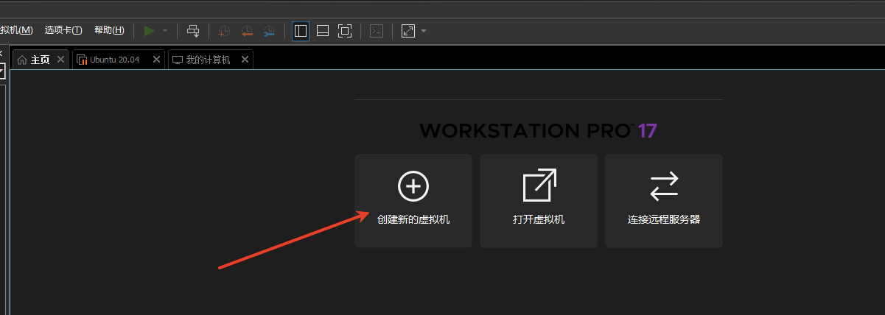

- 选择 `典型`，点击 `下一步`，如下图所示：

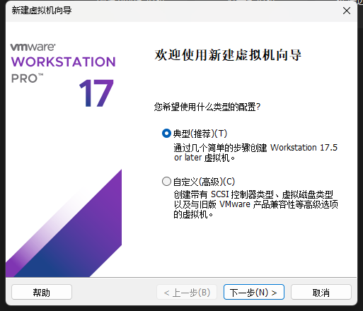


- 选择 `安装程序光盘映像文件(iso)文件`，点击 `浏览`，选择下载好的 Ubuntu 镜像文件，点击 `下一步`，如下图所示：

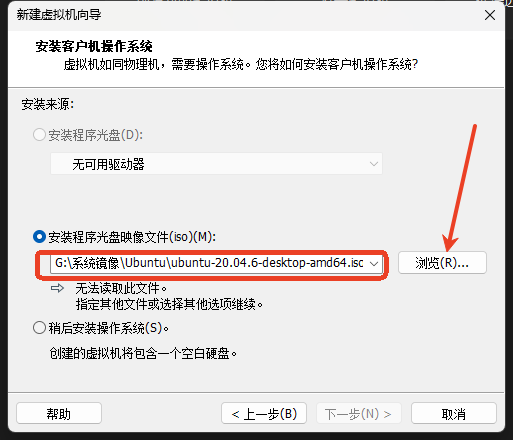

- 给你的Linux 起个好听的名字，并且起一个用户名，并且输入密码，点击 `下一步`，如下图所示：

::: warning 一定要记住设置的密码。登录的时候需要用的
:::

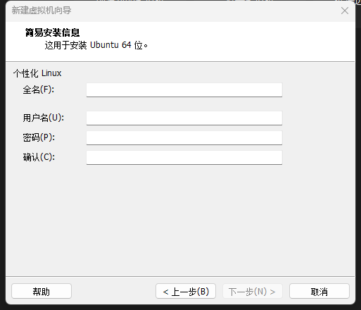


- 选择 Ubuntu 虚拟机的安装位置，点击 `下一步`，如下图所示：


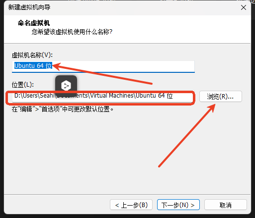

- 输入`虚拟机磁盘大小:50G`(默认20G，建议50G以上)，选择`将虚拟磁盘存储为单个文件`，点击 `下一步`，如下图所示：

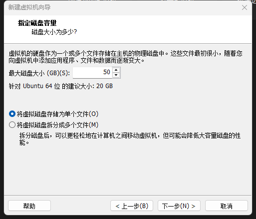


- 保持默认，点击`完成`,如下图所示：

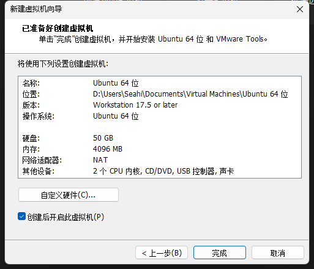

::: details 如果有下方提示，`确定` 即可,

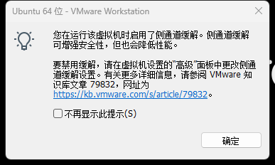
:::

::: details 安装过程

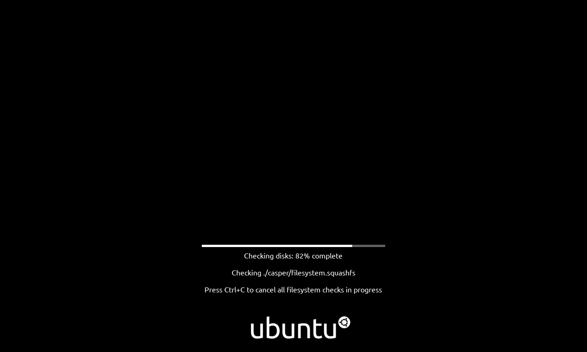

:::

::: details 安装成功

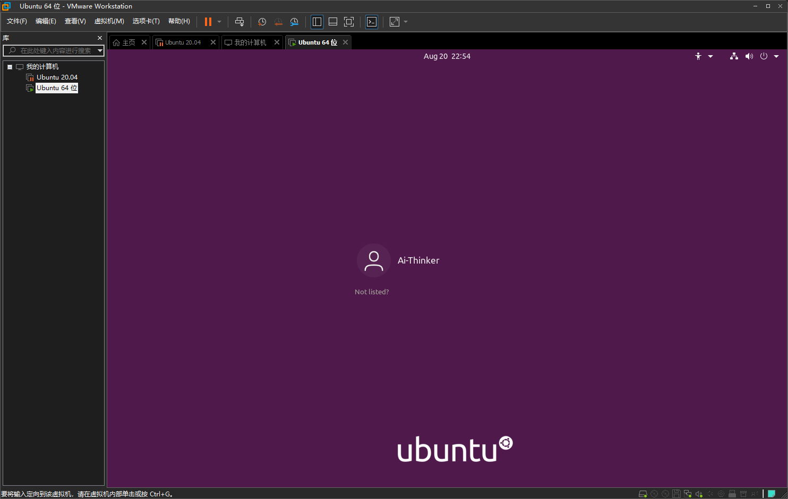

:::

### 更换镜像源

- 终端使用（打开终端快捷键：`Ctrl`+`Alt`+`T` ）下方指令：

::: tip 复制下方指令，在终端使用 `鼠标中键`即可粘贴。 
:::

```bash
sudo nano /etc/apt/sources.list
```

::: details  把原本的几个内容使用`"#"` 注释掉，例如：

<div style="display: flex; flex-wrap: wrap; gap: 20px; padding: 0 10px;">
  <!-- 第一张图片 -->
  <div style="flex: 1; min-width: 100px; padding: 15px; border-radius: 8px; display: flex; align-items: center; justify-content: center;">
	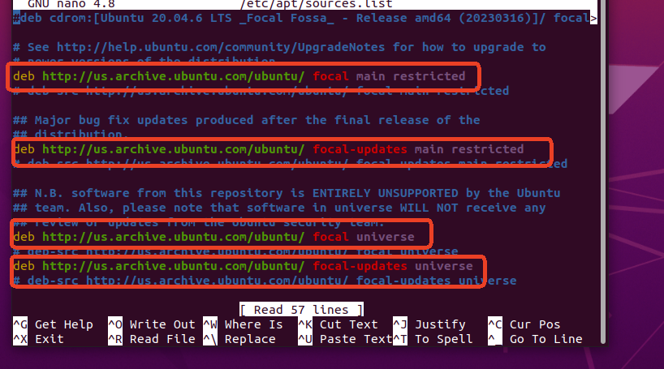
  </div>
  
  <!-- 第二张图片 -->
  <div style="flex: 1; min-width: 100px; padding: 15px; border-radius: 8px; display: flex; align-items: center; justify-content: center;">
	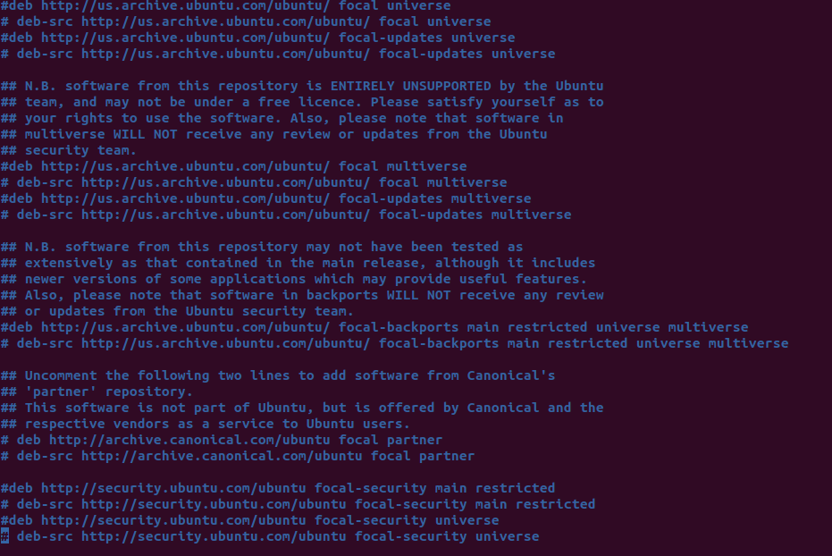
  </div>
  
</div>

:::

- 把内容全部替换为下方的源地址(`三选一即可`)：

::: details 清华源:ubuntu20.04

```bash
#默认注释了源码镜像以提高 apt update 速度，如有需要可自行取消注释

deb https://mirrors.tuna.tsinghua.edu.cn/ubuntu/ focal main restricted universe multiverse
# deb-src https://mirrors.tuna.tsinghua.edu.cn/ubuntu/ focal main restricted universe multiverse

deb https://mirrors.tuna.tsinghua.edu.cn/ubuntu/ focal-updates main restricted universe multiverse
# deb-src https://mirrors.tuna.tsinghua.edu.cn/ubuntu/ focal-updates main restricted universe multiverse

deb https://mirrors.tuna.tsinghua.edu.cn/ubuntu/ focal-backports main restricted universe multiverse
# deb-src https://mirrors.tuna.tsinghua.edu.cn/ubuntu/ focal-backports main restricted universe multiverse

#以下安全更新软件源包含了官方源与镜像站配置，如有需要可自行修改注释切换

deb http://security.ubuntu.com/ubuntu/ focal-security main restricted universe multiverse
# deb-src http://security.ubuntu.com/ubuntu/ focal-security main restricted universe multiverse

```
:::

::: details 阿里源:ubuntu20.04
```bash
deb https://mirrors.aliyun.com/ubuntu/ focal main restricted universe multiverse
# deb-src https://mirrors.aliyun.com/ubuntu/ focal main restricted universe multiverse

deb https://mirrors.aliyun.com/ubuntu/ focal-security main restricted universe multiverse
# deb-src https://mirrors.aliyun.com/ubuntu/ focal-security main restricted universe multiverse

deb https://mirrors.aliyun.com/ubuntu/ focal-updates main restricted universe multiverse
# deb-src https://mirrors.aliyun.com/ubuntu/ focal-updates main restricted universe multiverse

# deb https://mirrors.aliyun.com/ubuntu/ focal-proposed main restricted universe multiverse

# deb-src https://mirrors.aliyun.com/ubuntu/ focal-proposed main restricted universe multiverse

deb https://mirrors.aliyun.com/ubuntu/ focal-backports main restricted universe multiverse
deb-src https://mirrors.aliyun.com/ubuntu/ focal-backports main restricted universe multiverse
```
:::

::: details 中科大源:ubuntu20.04
```bash
# 默认注释了源码仓库，如有需要可自行取消注释

deb https://mirrors.ustc.edu.cn/ubuntu/ focal main restricted universe multiverse
# deb-src https://mirrors.ustc.edu.cn/ubuntu/ focal main restricted universe multiverse

deb https://mirrors.ustc.edu.cn/ubuntu/ focal-security main restricted universe multiverse
# deb-src https://mirrors.ustc.edu.cn/ubuntu/ focal-security main restricted universe multiverse

deb https://mirrors.ustc.edu.cn/ubuntu/ focal-updates main restricted universe multiverse
# deb-src https://mirrors.ustc.edu.cn/ubuntu/ focal-updates main restricted universe multiverse

deb https://mirrors.ustc.edu.cn/ubuntu/ focal-backports main restricted universe multiverse
# deb-src https://mirrors.ustc.edu.cn/ubuntu/ focal-backports main restricted universe multiverse

```
:::

::: details 替换完成示例（`阿里源为例`）：


<div style="display: flex; flex-wrap: wrap; gap: 20px; padding: 0 10px;">
  <!-- 第一张图片 -->
  <div style="flex: 1; min-width: 90px; padding: 15px; border-radius: 8px; display: flex; align-items: center; justify-content: center;">
	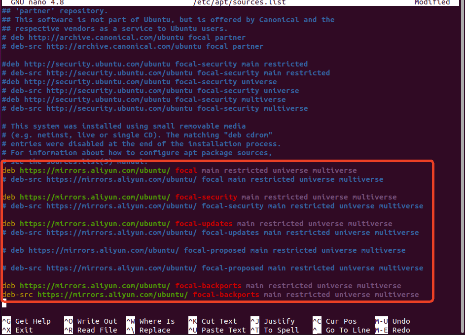
  </div>
  
</div>


:::

- `Ctrl`+`O` 保存，`Ctrl`+`X` 退出

### 更新源

::: tip 复制下方指令，在终端使用 `鼠标中键`即可粘贴。 
:::

```bash
sudo apt update
```
::: details 示例（`阿里源为例`）：
<div style="display: flex; flex-wrap: wrap; gap: 20px; padding: 0 10px;">
  <!-- 第一张图片 -->
  <div style="flex: 1; min-width: 90px; padding: 15px; border-radius: 8px; display: flex; align-items: center; justify-content: center;">
	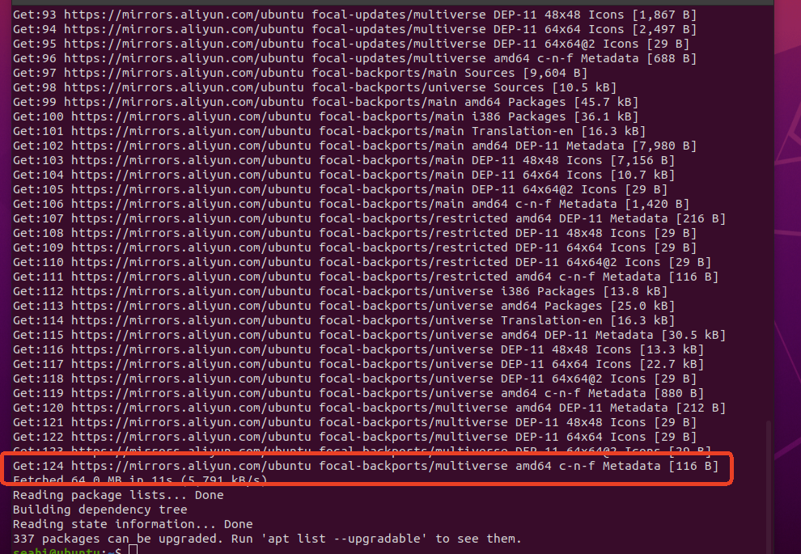
  </div>
  
</div>
:::

- 更新软件

::: tip 复制下方指令，在终端使用 `鼠标中键`即可粘贴。 这一步更新会花费一些时间，请耐心等待
:::

```bash
sudo apt upgrade
```

### 安装必要的工具

::: tip 复制下方指令，在终端使用 `鼠标中键`即可粘贴。 这一步更新会花费一些时间，请耐心等待
:::

```bash
sudo apt-get install vim git net-tools ssh python2 python3-pip
```
::: tip 工具说明

- vim：终端文本编辑器
- git：代码仓库管理工具，用于获取代码
- net-tools：网络工具包，用于查看 网络IP 地址
- ssh：远程连接工具
- python3-pip：Python包管理工具

:::

### 一些必要的配置

- 添加到 `dialout` 用户组

```bash
sudo usermod -a -G dialout $USER
```
- 设置 `python` 版本 

::: tip python2 和 python3 都要执行一次
:::

::: code-group

```bash [python2]
sudo update-alternatives --install /usr/bin/python python /usr/bin/python2 100
```

```bash [python3]
sudo update-alternatives --install /usr/bin/python python /usr/bin/python3 150
```
:::

::: tip 以后只需要使用下方指令切换 python 版本
```bash
sudo update-alternatives --config python 
```
如图所示,输入相应的数字选择 python 版本即可：

<center>

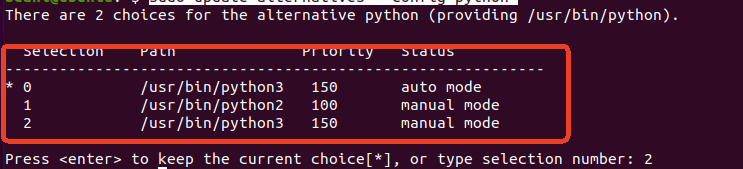
</center>
:::

### Ubuntu安装成功

::: tip 你的Ubunut 已经安装成功，如需继续完成开发环境配置，请参考下方内容：
:::

- 👉[**安装VScode并远程连接Ubunut**](/tutorial/Linux/VScode_install)

## WSL安装 Ubuntu
### 安装 Ubuntu20.04 
按住 `shift + 鼠标右键` 重新打开 `PowerShell`，运行下发指令安装 `Ubutun20.04`:
```shell
 wsl --install -d Ubuntu-20.04
```

::: details 开始安装示例：

:::
