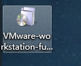
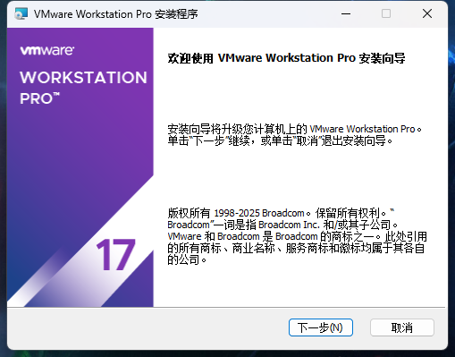
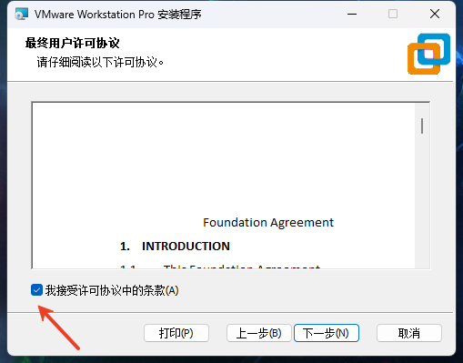
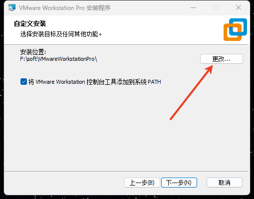
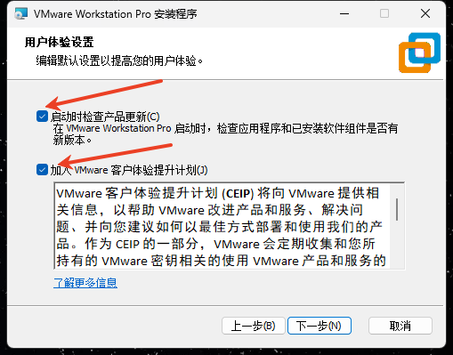
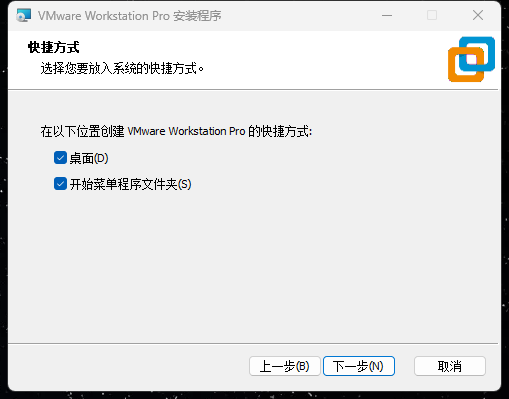
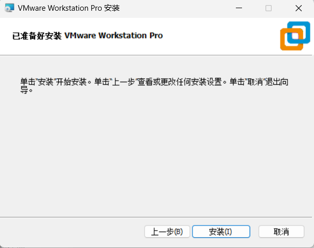
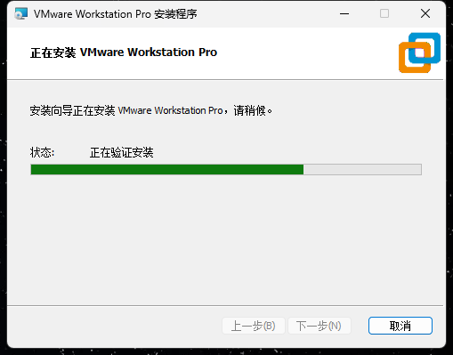
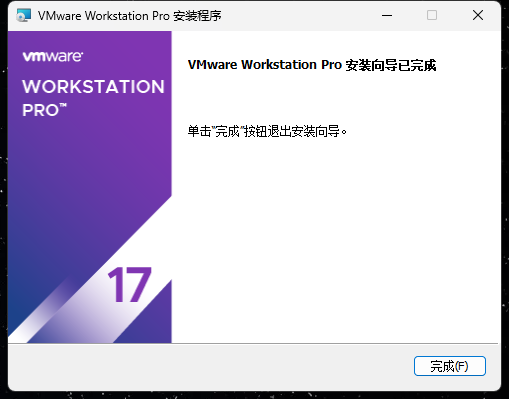
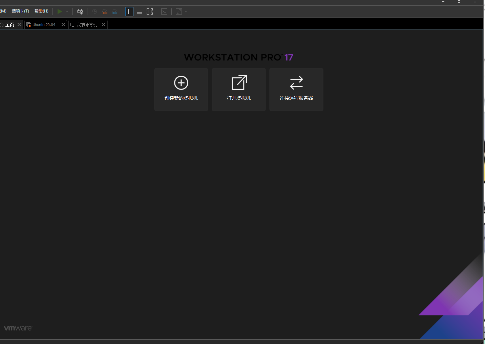

## 安装虚拟机

- 下载虚拟机软件VMware Workstation Player，[点击下载](https://aithinker-static.oss-cn-shenzhen.aliyuncs.com/docs/media/tools/VMware-workstation-full-17.6.4-24832109.exe)

::: tip 下载完成之后，运行安装包：
:::

## 完成安装

- 👇点击`下一步`，如下图所示：

 

- 👇同意许可并 点击`下一步`，如下图所示：

 

- 👇选择安装位置，点击`下一步`，如下图所示：

 

- 👇再次点击下一步：

 

- 👇快捷方式保持默认，点击`下一步`：

 

- 👇点击`安装`：

 

- 👇等待安装完成，如下图所示：

- 👇点击`完成`：

 

## 运行实例

 

## 安装 Ubuntu

- 请参考[安装 Ubuntu](/tutorial/Linux/ubuntu_install)章节