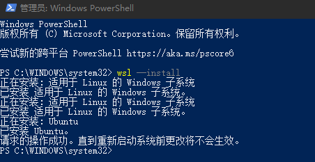
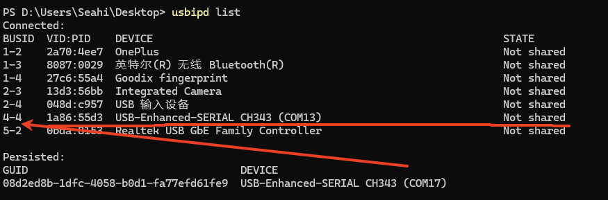

::: tip ❤️温馨提示
推荐使用WSL（Windows下的Linux 子系统）进行开发
:::

## 安装Linxu 子系统
使用 以管理员身份运行 PowerShell。在 PowerShell 下方指令安装Linux 子系统：

```shell
wsl --install
```
::: details 安装完成示例：

:::
## 重启电脑（记得保存资料）

## 安装Ubuntu
请参考[Ubuntu 安装](/tutorial/Linux/ubuntu_install)章节
## WSL2 串口映射
::: tip ❤️温馨提示
Windows 11 的WSL2不支持自动串口映射，当你的串口接入到Windows后，需要在WSL2中手动映射串口。
:::
### 安装 USBIPD-WIN

- 点击下载 USBIPD-WIN 5.2.0: [`usbipd-win_5.2.0_x64.msi`](https://aithinker-static.oss-cn-shenzhen.aliyuncs.com/docs/media/development/tools/usbipd-win_5.2.0_x64.msi)
- 双击安装，根据提示完成安装
- 重启电脑
### 连接 USB 设备
#### 步骤1
在附加 USB 设备之前，请确保 WSL 命令行处于打开状态。 这会使 WSL 2 轻型 VM 保持运行。

::: tip 通过以 管理员 模式打开 PowerShell 并输入以下命令列出连接到 Windows 的所有 USB 设备。 列出设备后，选择并复制要附加到 WSL 的设备总线 ID。
:::

```shell
usbipd list
```
::: details 示例：

:::
#### 步骤2
::: tip 在附加 USB 设备之前，必须使用该命令 usbipd bind 来共享设备，从而允许它附加到 WSL。 这需要管理员权限。 选择要在 WSL 中使用的设备的总线 ID，然后运行以下命令。 运行命令后，请再次使用命令 usbipd list 验证设备是否共享。
:::

```shell
usbipd bind --busid 4-4
```
> `4-4` 是总线 ID，请根据实际情况替换
#### 步骤3
::: tip 若要附加 USB 设备，请运行以下命令。 （不再需要使用提升的管理员提示。确保 WSL 命令提示符处于打开状态，以使 WSL 2 轻型 VM 保持活动状态。 请注意，只要 USB 设备连接到 WSL，Windows 将无法使用它。 一旦连接到 WSL，任何在 WSL 2 上运行的发行版都可以使用该 USB 设备。 请确认设备是否已连接 usbipd list。 在 WSL 提示符下，运行 lsusb 以验证 USB 设备是否已列出，并且可以使用 Linux 工具与之交互。
:::

```shell
usbipd attach --wsl --busid <busid>
```
#### 步骤4
::: tip 打开 Ubuntu（或首选 WSL 命令行），并使用以下命令列出附加的 USB 设备：
:::
```shell
ls /dev/ttyACM*
```
> 应会看到刚刚附加的设备，并且能够使用普通 Linux 工具与之交互。 根据应用程序，可能需要配置 udev 规则，以允许非根用户访问设备。
### 断开连接

::: tip 在 WSL 中使用设备后，可以物理断开 USB 设备的连接，或者从 PowerShell 运行以下命令：
:::

```shell
usbipd detach --busid <busid>
```
> `<busid>` 是总线 ID，请根据实际情况替换