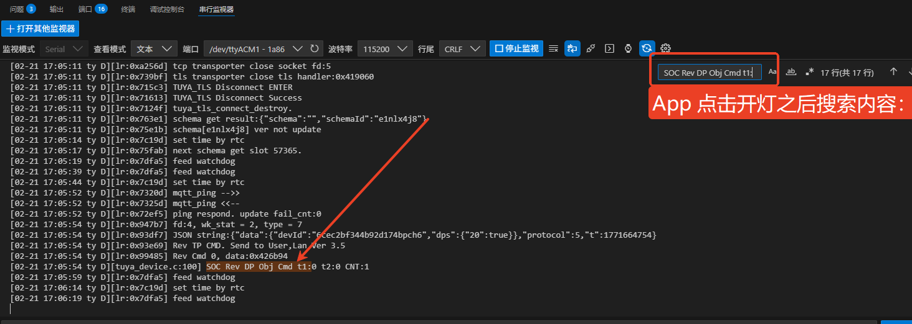

## 概述
在上一章中，已经成功连接到 Tuya 平台，并且在 App 中添加了一个设备。但是那支持最简单的配网实现，没有错误、配网状态打印、启动配网等功能。<br>因此，上述功能会在本章当中统一添加，并介绍如何通过 “智能生活App” 实现控制 T2-U 开发板上的 LED 灯。

::: warning 注意
本章内容较多，建议先完成配网功能的完善，再进行后续操作。
:::

## 完善配网功能

### 状态处理
TuyaOS 的 Wi-Fi 单品免不了几个状态：
::: info 状态列表
- 联网成功：联网成功之后，需要发起MQTT 连接到服务器
- 网络断开: 当网络断开时，需要关闭MQTT 连接
- MQTT 连接状态: 当MQTT 连接状态发生改变时，需要打印当前状态
:::
这三个状态需要开发者自行订阅，并在回调函数中处理。可参考以下示例:
::: warning 注意:在开始订阅事件时，先引用 *`tuya_svc_netmgr.h`* 和 *`mqc_app.h`* 头文件,不同的事件可以使用一个回调函数进行处理。
:::
::: code-group

``` C [订阅状态]
ty_subscribe_event(EVENT_LINK_UP, "quickstart", __soc_dev_net_status_cb, SUBSCRIBE_TYPE_NORMAL);// 联网成功
ty_subscribe_event(EVENT_LINK_DOWN, "quickstart", __soc_dev_net_status_cb, SUBSCRIBE_TYPE_NORMAL);// 网络断开
ty_subscribe_event(EVENT_MQTT_CONNECTED, "quickstart", __soc_dev_net_status_cb, SUBSCRIBE_TYPE_NORMAL);// MQTT 连接状态
```
```C [__soc_dev_net_status_cb]
STATIC OPERATE_RET __soc_dev_net_status_cb(VOID *data)
{
    STATIC BOOL_T s_syn_all_status = FALSE;

    TAL_PR_DEBUG("network status changed!");
    if (tuya_svc_netmgr_linkage_is_up(LINKAGE_TYPE_DEFAULT))
    {
        TAL_PR_DEBUG("linkage status changed, current status is up");
        if (get_mqc_conn_stat())
        {
            TAL_PR_DEBUG("mqtt is connected!");

            if (FALSE == s_syn_all_status)
            {
                //upload_device_all_status(); // 没有定义该函数，先保留，后续再添加
                s_syn_all_status = TRUE;
            }
            // UserTODO
        }
    }
    else
    {
        TAL_PR_DEBUG("linkage status changed, current status is down");

        // UserTODO
    }

    return OPRT_OK;
}
```
:::


### 日志打印
上一章当中，我们在对设备进行 soc 初始化时，只是创建了 TY_IOT_CBS_S iot_cbs 回调结构体，但是并没有定义它的回调函数。<br>
因此，在这一章当中，我们会完善配网功能，添加日志打印功能。

::: details TY_IOT_CBS_S 结构体定义如下：

``` C
typedef struct {
    /** status update */
    GW_STATUS_CHANGED_CB gw_status_cb; // 设备激活的状态发生改变
    /** gateway upgrade */
    GW_UG_INFORM_CB gw_ug_cb; // 设备上线回调函数
    /** gateway reset */
    GW_RESET_IFM_CB gw_reset_cb; // 设备重置回调函数
    /** structured DP info */
    DEV_OBJ_DP_CMD_CB dev_obj_dp_cb; //  obj 类型 DP 指令下发
    /** raw DP info */
    DEV_RAW_DP_CMD_CB dev_raw_dp_cb; // 有 raw 类型 DP 指令下发
    /** DP query */
    DEV_DP_QUERY_CB dev_dp_query_cb; // 需要查询指定 DP 当前的状态
    /** sub-device upgrade */
    DEV_UG_INFORM_CB dev_ug_cb; // 所属的子设备开始进入升级流程，并告知开发者拉取升级数据时所需的 URL 等必要信息。
    /** sub-device reset */
    DEV_RESET_IFM_CB dev_reset_cb; // 设备所属的子设备被重置了（单品类设备无需关心）
    /** active short url */
    ACTIVE_SHORTURL_CB active_shorturl; // 支持扫码激活
    /** gateway upgrade pre-condition */
    GW_UG_INFORM_CB pre_gw_ug_cb; // 网关升级前置条件回调函数
    /** sub-device upgrade pre-condition */
    DEV_UG_INFORM_CB pre_dev_ug_cb; // 通知开发者，设备所属的子设备有升级请求，开发者通过返回值告诉开发框架当前是否允许升级。
} TY_IOT_CBS_S;
```
:::

在上一章当中，即使不定义回调函数，程序也可以正常运行。因此，我们只需要定义几个必要的回调函数即可。它们分别是：
::: info 回调函数列表
- gw_status_cb：设备激活的状态发生改变时，打印当前状态;<br>
- gw_ug_cb：设备上线回调函数,打印上线成功日志;<br>
- gw_reset_cb：设备重置回调函数，打印重置成功日志;<br>
- dev_obj_dp_cb：obj 类型 DP 指令下发回调函数，打印指令内容;<br>
- dev_raw_dp_cb：raw 类型 DP 指令下发回调函数，打印指令内容;<br>
- dev_dp_query_cb：需要查询指定 DP 当前的状态回调函数，打印查询结果。<br>
:::
代码如下：
::: code-group

``` C [iot_cbs 结构体]
TY_IOT_CBS_S iot_cbs = {
  .gw_status_cb = __soc_dev_status_changed_cb,
  .gw_ug_cb = __soc_dev_rev_upgrade_info_cb,
  .gw_reset_cb = __soc_dev_reset_inform_cb,
  .dev_obj_dp_cb = __soc_dev_obj_dp_cmd_cb,
  .dev_raw_dp_cb = __soc_dev_raw_dp_cmd_cb,
  .dev_dp_query_cb = __soc_dev_dp_query_cb,
};
```
``` C [__soc_dev_status_changed_cb]
STATIC VOID_T __soc_dev_status_changed_cb(IN CONST GW_STATUS_E status)
{
    TAL_PR_DEBUG("SOC TUYA-Cloud Status:%d", status);
    return;
}
```
``` C [__soc_dev_rev_upgrade_info_cb]
STATIC OPERATE_RET __soc_dev_rev_upgrade_info_cb(IN CONST FW_UG_S *fw)
{
    TAL_PR_DEBUG("SOC Rev Upgrade Info");
    TAL_PR_DEBUG("fw->tp:%d", fw->tp);
    TAL_PR_DEBUG("fw->fw_url:%s", fw->fw_url);
    TAL_PR_DEBUG("fw->fw_hmac:%s", fw->fw_hmac);
    TAL_PR_DEBUG("fw->sw_ver:%s", fw->sw_ver);
    TAL_PR_DEBUG("fw->file_size:%u", fw->file_size);

    return OPRT_OK;
}
```
``` C [__soc_dev_reset_inform_cb]
STATIC VOID_T __soc_dev_reset_inform_cb(GW_RESET_TYPE_E type)
{
    TAL_PR_DEBUG("reset type %d", type);

    return;
}
```
``` C [__soc_dev_obj_dp_cmd_cb]
STATIC VOID_T __soc_dev_obj_dp_cmd_cb(IN CONST TY_RECV_OBJ_DP_S *dp)
{

    TAL_PR_DEBUG("SOC Rev DP Obj Cmd t1:%d t2:%d CNT:%u", dp->cmd_tp, dp->dtt_tp, dp->dps_cnt);
    return;
}
```
``` C [__soc_dev_raw_dp_cmd_cb]
STATIC VOID_T __soc_dev_raw_dp_cmd_cb(IN CONST TY_RECV_RAW_DP_S *dp)
{
    TAL_PR_DEBUG("SOC Rev DP Raw Cmd t1:%d t2:%d dpid:%d len:%u", dp->cmd_tp, dp->dtt_tp, dp->dpid, dp->len);

    return;
}
```
``` C [__soc_dev_dp_query_cb]
STATIC VOID_T __soc_dev_dp_query_cb(IN CONST TY_DP_QUERY_S *dp_qry)
{
    UINT32_T index = 0;

    TAL_PR_DEBUG("SOC Rev DP Query Cmd");
    if (dp_qry->cid != NULL)
    {
        TAL_PR_ERR("soc not have cid.%s", dp_qry->cid);
    }

    if (dp_qry->cnt == 0)
    {
        TAL_PR_DEBUG("soc rev all dp query");
    }
    else
    {
        TAL_PR_DEBUG("soc rev dp query cnt:%d", dp_qry->cnt);
        for (index = 0; index < dp_qry->cnt; index++)
        {
            TAL_PR_DEBUG("rev dp query:%d", dp_qry->dpid[index]);
            // UserTODO
        }
    }

    return;
}
```
:::
#### 烧录验证
修改完代码后，需要重新烧录程序到开发板上。打开串口监视，成功日志如下：

<center>


</center>


### 重置配网
当前代码，设备如果已经配置了 Wi-Fi ，会自动把 Wi-Fi 连接信息保存起来，等待下次上电时自动连接。如果没有重置配网操作的话，设备会保持之前的 Wi-Fi 连接，无法进入配网模式，这时候就需要通过重置配网操作来重新配置 Wi-Fi 连接。<br>
通对于有按键的设备，有以下操作进入配网模式:

::: note 配网操作
- 长按配网： 长按设备上的配网按键，直到指示灯闪烁，说明设备进入配网模式。
- 短按数次配网： 短按设备上的配网按键，达到配网次数之后，进入配网模式。
- 复位次数配网： 通过复位的次数重置配网，从而进入配网模式。 
:::

::: note 没有按键的设备
如果设备没有按键，通常是重启次数配网，即让设备上电/断电几次，直到指示灯闪烁，说明设备进入配网模式。
:::

T2-U 开发板上，正好有一个按键连接到了 `P7` 引脚，我们可以通过长按该按键来进入配网模式。

```steps
- icon: "/svg/new.svg"
  title: "第一步"
  text: "新建 `user_key.c` 和 `user_key.h` 文件用来开发 P7 按键的驱动代码和逻辑。"
  image: "/img/tuya/appled/step1.png"
  alt: "无效图片"

- icon: "/svg/new.svg"
  title: "第二步"
  text: "在 `user_key.c` 文件中实现按键的初始化和扫描任务。[查看代码](#示例代码)"
  <!-- image: "/img/tuya/appled/step2.png" -->
  alt: "无效图片"

- icon: "/svg/set.svg"
  title: "第三步"
  text: "在 `user_key.h` 文件中定义按键的相关常量和函数接口。[查看代码](#示例代码)"
  alt: "无效图片"

- icon: "/svg/ok.svg"
  title: "第四步"
  text: "在 `tuya_device.c` 的 *uaer_main* 调用 `user_key_init();` 即可。"
  image: "/img/tuya/appled/step4.png"
  alt: "无效图片"
```
#### 示例代码

:::details 查看代码
::: code-group
```C [user_key.c]
/**
 * @file user_key.c
 * @author Seahi-Mo (seahi-mo@foxmail.com)
 * @brief 按键处理模块，实现设备配网和重置功能
 * @version 0.1
 * @date 2026-02-21
 *
 * @copyright SeaHi (c) 2026
 *
 */
#include "tkl_gpio.h"
#include "tal_log.h"
#include "tal_system.h"
#include "tal_thread.h"
#ifdef ENABLE_WIFI_SERVICE
#include "tuya_iot_wifi_api.h"
#else
#include "tuya_iot_base_api.h"
#endif
#include "user_key.h"

/**
 * @brief 按键引脚定义
 */
STATIC TUYA_GPIO_NUM_E user_key_pin_id = USER_KEY_PIN_ID;

/**
 * @brief 按键监控任务函数
 * @param args 任务参数（未使用）
 * @return 无
 * @note 该函数在独立线程中运行，持续监控按键状态
 *       实现了长按按键检测，长按触发设备重置和配网
 */
STATIC VOID_T app_key_task(VOID_T *args)
{
	OPERATE_RET op_ret = OPRT_OK;						 // 操作返回值
	TUYA_GPIO_LEVEL_E read_level = TUYA_GPIO_LEVEL_HIGH; // 读取的按键电平
	UINT32_T time_start = 0, timer_end = 0;				 // 按键按下开始和结束时间

	// 无限循环监控按键状态
	for (;;)
	{
		// 读取按键当前电平
		tkl_gpio_read(user_key_pin_id, &read_level);

		// 检测到按键按下（低电平）
		if (TUYA_GPIO_LEVEL_LOW == read_level)
		{
			// 3ms延时去抖
			tal_system_sleep(3);
			// 再次读取电平确认
			tkl_gpio_read(user_key_pin_id, &read_level);

			// 如果电平不是低电平，说明是抖动，跳过本次检测
			if (TUYA_GPIO_LEVEL_LOW != read_level)
			{
				continue; // jitter
			}

			// 记录按键按下的开始时间
			time_start = tal_system_get_millisecond();

			// 持续检测按键状态，直到按键释放
			while (TUYA_GPIO_LEVEL_LOW == read_level)
			{
				// 30ms延时，避免频繁读取
				tal_system_sleep(30);
				// 读取当前按键电平
				tkl_gpio_read(user_key_pin_id, &read_level);
				// 记录当前时间
				timer_end = tal_system_get_millisecond();

				// 检查是否达到长按时间阈值
				if (timer_end - time_start >= LONE_PRESS_TIME)
				{
					// 输出长按日志
					TAL_PR_DEBUG("long press, remove device");
					/* 长按状态达成，重置设备，触发配网 */
					// 调用涂鸦IoT接口，重置设备并进入配网模式
					op_ret = tuya_iot_wf_gw_unactive();

					// 检查操作是否成功
					if (op_ret != OPRT_OK)
					{
						// 输出错误日志
						TAL_PR_ERR("long press tuya_iot_wf_gw_unactive error, %d", op_ret);
					}
					// 退出长按检测循环
					break;
				}
			}
		}

		// 100ms延时，降低CPU占用
		tal_system_sleep(100);
	}

	return;
}

/**
 * @brief 按键初始化函数
 * @return VOID_T 无
 * @note 初始化按键GPIO引脚并创建按键监控线程
 */
VOID_T app_key_init(VOID_T)
{
	OPERATE_RET rt = OPRT_OK;

	// 初始化按键引脚
	TUYA_GPIO_BASE_CFG_T key_cfg = {
		.mode = TUYA_GPIO_PULLUP,	  // 上拉模式
		.direct = TUYA_GPIO_INPUT,	  // 输入方向
		.level = TUYA_GPIO_LEVEL_HIGH // 初始高电平
	};
	// 初始化GPIO并记录错误日志
	TUYA_CALL_ERR_LOG(tkl_gpio_init(user_key_pin_id, &key_cfg));

	/* 创建并启动按键监控线程 */
	THREAD_HANDLE key_task_handle; // 线程句柄
	THREAD_CFG_T thread_cfg = {
		.thrdname = "user_key_task", // 线程名称
		.priority = THREAD_PRIO_6,	 // 线程优先级
		.stackDepth = 4096			 // 线程栈大小
	};
	// 创建并启动线程，记录错误日志
	TUYA_CALL_ERR_LOG(tal_thread_create_and_start(&key_task_handle, NULL, NULL, app_key_task, NULL, &thread_cfg));

	return;
}
```

```C [user_key.h]
/**
 * @file user_key.h
 * @author Seahi-Mo (seahi-mo@foxmail.com)
 * @brief
 * @version 0.1
 * @date 2026-02-21
 *
 * @copyright SeaHi (c) 2026
 *
 */
#ifndef __USER_KEY_H__
#define __USER_KEY_H__

#define LONE_PRESS_TIME 3000 // long press time, uint: ms
#define USER_KEY_PIN_ID 7  // 按键GPIO引脚号，根据实际硬件连接修改

VOID_T app_key_init(VOID_T);
#endif

```
:::

### LED 网络指示
重置配网完成之后，还有一个问题：T2-U 开发板不看日志的话，无法知道当前是否处于配网模式或已经成功连接，这时候就需要通过 LED 网络指示来判断。<br>
但是又因为我们需要用 App 控制这一盏 LED 灯,因此需要对 LED 灯的状态进行分类处理，可以分为以下三种状态：
::: note LED 状态划分
- 未连接/配网失败：LED 灯快闪（闪烁间隔 100ms）
- 配网模式：LED 灯慢闪（闪烁间隔 500ms）
- 已连接：LED 灯常亮
:::

``` steps
- icon: "/svg/new.svg"
  title: "第一步"
  text: "新建 `net_led.c` 和 `net_led.h` 文件用来开发 LED 网络指示的驱动代码和逻辑。"
  image: "/img/tuya/appled/step2_1.png"
  alt: "无效图片"

- icon: "/svg/ecode.svg"
  title: "第二步"
  text: "在 `net_led.c` 文件中实现 LED 网络指示的驱动代码，包括初始化、快闪、慢闪和常亮等功能。[查看代码](#net_led_example)"
  alt: "无效图片"

- icon: "/svg/ecode.svg"
  title: "第三步"
  text: "在 `net_led.h` 文件中声明 LED 网络指示的驱动函数接口，包括初始化,控制亮灭等函数。"
  alt: "无效图片"

- icon: "/svg/ecode.svg"
  title: "第四步"
  text: "在 `tuya_device.c` 文件中调用初始化函数；<br> 在"
  alt: "无效图片"


```

#### 示例代码 {#net_led_example}
::: details 查看代码
::: code-group
```C [net_led.c]
/**
 * @file net_led.c
 * @author Seahi-Mo (seahi-mo@foxmail.com)
 * @brief
 * @version 0.1
 * @date 2026-02-21
 *
 * @copyright SeaHi (c) 2026
 *
 */
#include "tal_log.h"
#include "tkl_gpio.h"
#include "tal_thread.h"
#include "net_led.h"
#include "dp_process.h"
#include "tuya_svc_netmgr.h"
#include <gw_intf.h>

STATIC TUYA_GPIO_NUM_E sg_led_pin = NET_LED_GPIO_PORT;
STATIC UINT8_T cur_led_status = NET_LED_OFF;

THREAD_HANDLE blink_task_handle = NULL;

CHAR_T user_wifi_status = 0; // wifi状态

STATIC VOID_T status_display_task(VOID_T *args)
{
	for (;;)
	{
		switch (user_wifi_status)
		{
		case 0: // not connected
			set_led_status(NET_LED_ON);
			tal_system_sleep(50);
			set_led_status(NET_LED_OFF);
			tal_system_sleep(50);
			break;
		case 1: // connecting
			set_led_status(NET_LED_ON);
			tal_system_sleep(500);
			set_led_status(NET_LED_OFF);
			tal_system_sleep(500);
			break;
		case 2: // activated
			set_led_status(NET_LED_OFF);
			tal_system_sleep(1000);
			break;
		default:
			set_led_status(NET_LED_OFF);
			break;
		}
	}
	return;
}
VOID_T net_led_init(void)
{
	OPERATE_RET rt = OPRT_OK;

	TUYA_GPIO_BASE_CFG_T led_cfg = {
		.mode = TUYA_GPIO_PUSH_PULL,
		.direct = TUYA_GPIO_OUTPUT,
		.level = TUYA_GPIO_LEVEL_HIGH};
	TUYA_CALL_ERR_LOG(tkl_gpio_init(sg_led_pin, &led_cfg));
	set_led_status(NET_LED_OFF);

	THREAD_CFG_T blink_thread_cfg = {
		.thrdname = "led_task",
		.priority = THREAD_PRIO_6,
		.stackDepth = 4096};
	TUYA_CALL_ERR_LOG(tal_thread_create_and_start(&blink_task_handle, NULL, NULL, status_display_task, NULL, &blink_thread_cfg));
	return;
}

VOID_T set_led_status(BOOL_T led_status)
{
	if (NET_LED_ON == led_status)
	{
		tkl_gpio_write(sg_led_pin, TUYA_GPIO_LEVEL_HIGH);
	}
	else
	{
		tkl_gpio_write(sg_led_pin, TUYA_GPIO_LEVEL_LOW);
	}

	cur_led_status = led_status;
	return;
}

BOOL_T get_led_status(void)
{
	return cur_led_status;
}
```
```C [net_led.h]
/**
 * @file net_led.h
 * @author Seahi-Mo (seahi-mo@foxmail.com)
 * @brief
 * @version 0.1
 * @date 2026-02-21
 *
 * @copyright SeaHi (c) 2026
 *
 */

#ifndef __NET_LED_H__
#define __NET_LED_H__

#define NET_LED_GPIO_PORT 17
#define NET_LED_ON 0
#define NET_LED_OFF 1

extern BOOL_T user_wifi_status; // 0:未连接 1:正在配网或正在连接，2:已连接
VOID_T net_led_init(void);
VOID_T set_led_status(BOOL_T led_status);
BOOL_T get_led_status(void);
#endif

```
:::

## DP 数据处理


