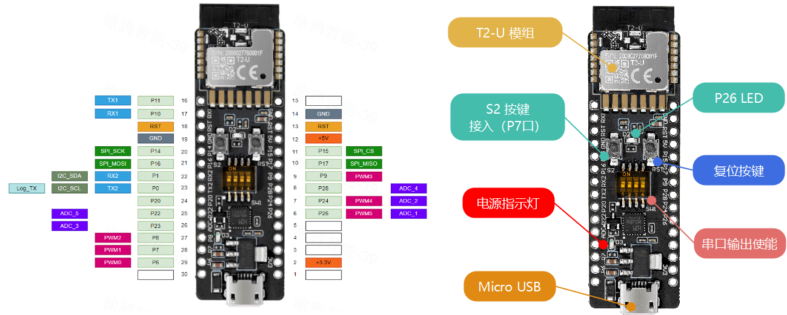
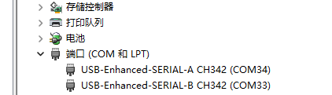
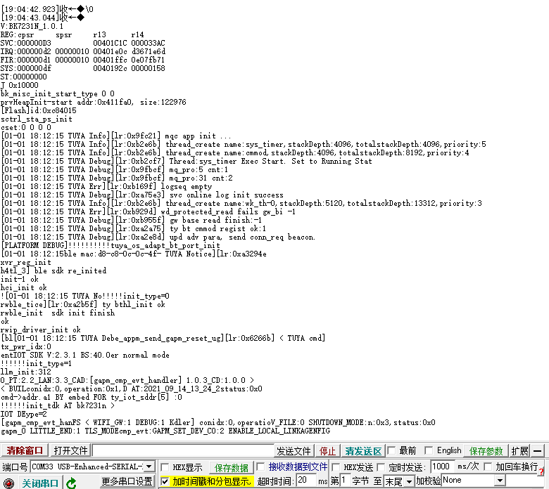

<center>


</center>

## T2-U 开发板

涂鸦 T2-U 开发板主控采用涂鸦智能开发的一款嵌入式 Wi-Fi 和蓝牙双模模组 T2-U，它由一个高集成度的无线射频模组 T2-U 和外围的按键、LED 指示灯、I/O 接口、电源和 USB 转串口芯片构成。<br>
T2-U 模组 内置了 32 bit RISC-MCU，最高 120M 主频、内置 2MB 内部 Flash、256K 内部 RAM，支持通过 TuyaOS 进行自定义开发。它可以通过 Wi-Fi 和蓝牙连接云端，您可以登录 涂鸦开发者平台 使用该模组开发多种 智能设备。

::: note ⚠️注意： T2-U 开发板默认出厂已烧录可连接云端的授权码，切勿全片擦除。
:::

<div style="display: flex; flex-wrap: wrap; gap: 24px; margin-bottom: 24px;">
  <div style="flex: 1; min-width: 300px;">
    <h3 style="margin-top: 0;">特性</h3>
    <ul>
      <li>支持 802.11b、802.11g、802.11n 标准</li>
      <li>通道 1-14@2.4GHz</li>
      <li>支持 WEP、WPA/WPA2、WPA/WPA2 PSK (AES)、WPA3 多种安全模式</li>
      <li>在 802.11b 模式下，支持最大 +16dBm 的输出功率</li>
      <li>支持 STA、AP、STA+AP 工作模式</li>
      <li>板载 PCB 天线，天线峰值增益为 2.2dBi</li>
      <li>支持低功耗蓝牙 V5.1 完整标准</li>
      <li>基于优先级的 Wi-Fi 和蓝牙共存控制模组，实现实时的优先级和收发调度</li>
      <li>蓝牙模式下，支持 6 dBm 发射功率</li>
      <li>板载 PCB 天线，天线峰值增益为 2.2dBi</li>
    </ul>
  </div>
  <div style="flex: 1; min-width: 300px;">
    <h3 style="margin-top: 0;">外设能力</h3>
    <ul>
      <li>PWM x 6</li>
      <li>Timer x 4</li>
      <li>UART x 2</li>
      <li>SPI x 1</li>
      <li>I2C x 1</li>
      <li>ADC x 5</li>
      <li>GPIO x 18</li>
    </ul>
  </div>
</div>

- **UART1 和 UART2 的功能区别**
  - UART1: 用于烧录固件和烧录授权码
  - UART2: 用于输出 log 信息，默认波特率 `115200`

## 引脚及接口




- 拨码开关功能

::: note `拨码开关`是用来选择串口是否连接到 T2-U 开发板的 TTL 芯片上（CH342）,以实现串口调试。当插入 USB 输出线时，电脑会识别 2 个 串口设备。设备管理器显示如下：



::: warning 注: CH342 是一个 USB 转双串口芯片，它可以同时接入 T2-U 模组的UART1 和 UART2。 
- `USB-Enhanced-SERIAL-A` CH342 接入的是 UART1
- `USB-Enhanced-SERIAL-B` CH342 接入的是 UART2。
:::

- UART1 接入 CH342: 把拨码开关的 `1` 和 `2` 拨到 `ON` 位置
- UART2 接入 CH342: 把拨码开关的 `3` 和 `4` 拨到 `ON` 位置

::: info 注: 拨码开关默认是不接入 CH342的，如果都拨到 `ON` 位置，T2-U 模组的 UART1 和 UART2 就会分别连接到 电脑的 串口设备上。
:::

## 查看启动日志

- 将拨码开关的 `3` 和 `4` 拨到 `ON` 位置，接入 UART2
- 打开串口调试工具，如 `PuTTY`，设置波特率为 `115200`，连接到 `COMx` 端口（x 为你的电脑识别的串口号）
- 重启 T2-U 开发板，你就可以在串口调试工具中查看启动日志了

如图：

<center></img></center>

## 快捷导航
::: navCard
```yaml
config:
    target: _self
data:
  - name: 安装开发环境
    desc: 安装 Tuya OS 开发环境
    link: /tutorial/tuya/osinstall
    img: /svg/install.svg
    badge: 第二步
    badgeType: tip
  - name: 编写第一个Tuya OS 应用
    desc: 实现打印 "Hello, Tuya!"
    link: /tutorial/tuya/oneapp
    img:  /svg/tuya.svg
    badge: 第三步
  # - name: 点亮一盏LED灯
  #   desc: 实现点亮开发板上的LED灯
  #   link: /tutorial/tuya/led
  #   img:  /svg/led.svg
  #   badge: 第四步
  # - name: 连接WiFi
  #   desc: 实现开发板连接到WiFi网络
  #   link: /tutorial/tuya/wifi
  #   img:  /svg/Wi-Fi.svg
  #   badge: 第五步
  # - name: 实现连接 Tuya 开发者平台
  #   desc: 实现开发板连接到 Tuya 开发者平台
  #   link: /tutorial/tuya/connect
  #   img:  /svg/tuya.svg
  #   badge: 第六步
```
:::