## 概述


TuyaOS 是 Tuya 公司开发的通用SDK，用于开发 Tuya 公司设计的模组。它提供了通用型的接口和功能，并兼容 Tuya 多款模组。<br>
而[Tuya Wind IDE](https://developer.tuya.com/cn/docs/iot-device-dev/tuyaos-wind-ide?id=Kbfy6kfuuqqu3) 是面向基于 TuyaOS 的开发者提供的一站式集成开发环境。<br>
它以 Visual Studio Code 插件形式发布，支持中英双语，通过 [涂鸦开发者平台](https://platform.tuya.com/) 账号登录。<br>
Tuya Wind IDE 统一管理、分发及更新 TuyaOS EasyGo 相关开发资料，提供了不同主机、不同开发工具下一致的开发体验。

::: navCard
```yaml

- name: TuyaOS
  desc: 涂鸦通用SDK
  link: https://developer.tuya.com/cn/docs/iot-device-dev/TuyaOS-Overview?id=Kbfjtwjcpn1gc
  img:  /svg/tuya.svg
  badge: 官方文档
  badgeType: tip
- name: Tuya Wind IDE
  desc: 一站式集成开发环境
  link: https://developer.tuya.com/cn/docs/iot-device-dev/tuyaos-wind-ide?id=Kbfy6kfuuqqu3
  img:  /svg/tuya.svg
  badge: 官方文档
  badgeType: tip
```
:::

::: note 笔记
- TuyaOS 的只能在 `Linux` 环境下编译，不支持 `Windows` 环境。
- 因为`Tuya Wind IDE` 是基于 Visual Studio Code 插件形式发布的，所以需要先安装 Visual Studio Code，再安装 `Tuya Wind IDE` 插件。
- 安装完成后，需要在 [涂鸦开发者平台](https://platform.tuya.com/) 注册账号才能登录使用。
- TuyaOS 的开发要在 `Tuya Wind IDE` 插件下进行
::: 


## 环境搭建流程

<center>

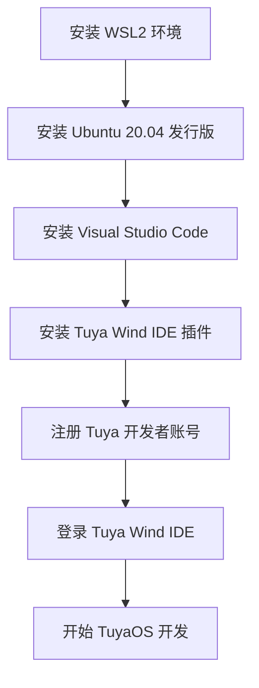
</center>

## 安装 WSL2 环境
::: navCard
```yaml
config:
    target: _self
data:

  - name: 安装 WSL2
    desc: 安装 Windows下的 Linux 子系统
    link: /tutorial/Linux/wsl_install
    img: /img/nav/WSL2.png
    badge: 方便快捷
```
:::
## 安装 Ubuntu 20.04 发行版
::: navCard
```yaml
config:
    target: _self
data:
  - name: 安装Ubuntu 20.04
    desc: 主流的 Linux 发行版
    link: /tutorial/Linux/ubuntu_install#wsl_ubuntu2024
    img:  /svg/ubuntu.svg
    badge: 小白必看
```
:::
## 安装 Visual Studio Code
::: navCard
```yaml
config:
    target: _self
data:
  - name: 安装VSCode
    desc: 代码编辑工具
    link: /tutorial/Linux/VScode_install
    img:  /img/nav/VSCode.png
    badge: 小白必看
```
:::


## 安装 Tuya Wind IDE 插件

- 步骤1：Visual Studio Code 先连接到 WSL2 环境，可参考：[连接 WSL](/tutorial/Linux/VScode_install#连接-wsl)
- 步骤2：在 Visual Studio Code 中安装 `Tuya Wind IDE` 插件。

<center>

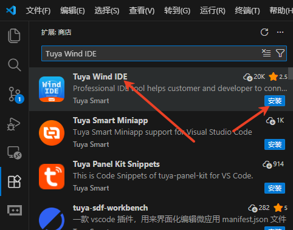

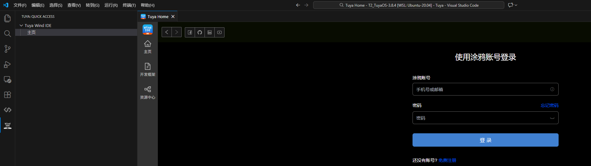
</center>

## 注册 Tuya 开发者账号
点击下方连接注册 Tuya 开发者账号。
::: navCard
```yaml
data:
  - name: 注册 Tuya 开发者账号
    desc: Tuya 开发者账号页面
    link: https://auth.tuya.com/register?from=http%3A%2F%2Fplatform.tuya.com%2F
    img: /svg/tuya.svg
    badge: Tuya 开发者平台
```
:::

## 登录 Tuya Wind IDE
- 步骤1：在 Visual Studio Code 中点击 `Tuya Wind IDE` 插件图标，打开 `Tuya Wind IDE` 登录页面。
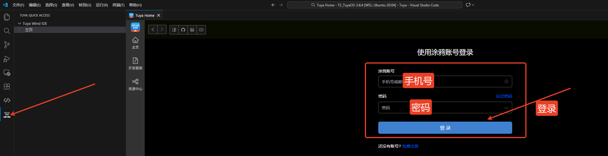

- 步骤2：在 `Tuya Wind IDE` 登录页面，输入之前注册的 Tuya 开发者账号邮箱和密码，点击登录。登录成功示例如下：
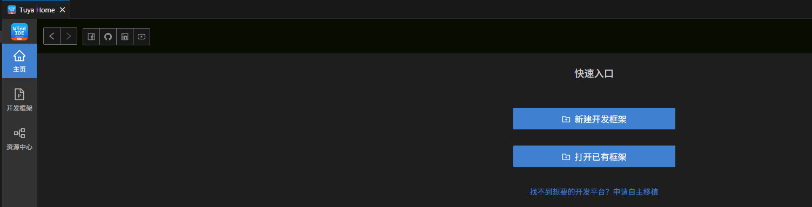

## 开始 TuyaOS 开发

### 1. 搜索开发包

- 在 `Tuya Wind IDE` 的资源中心中，`开发模式` 选项选择 `TuyaOS OS 开发`。<br><br>
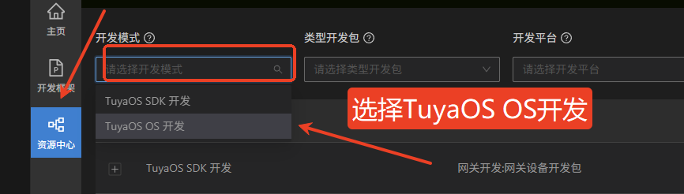<br><br>
- `类型开发包` 选项选择 `Wi-Fi设备开发包`<br><br>
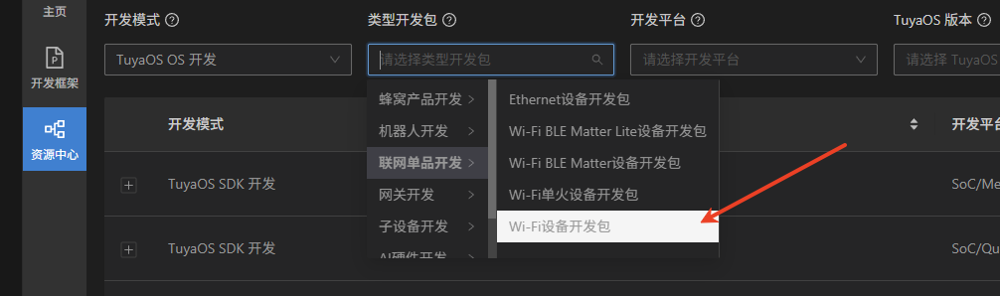<br><br>
- `开发平台` 选项选择 `T2`<br><br>
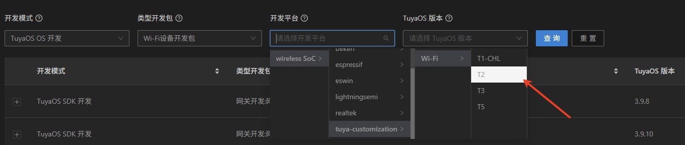<br><br>
- `TuyaOS 版本` 选项选择 `3.8.4`,点击 `查询`，查询到 `3.8.4` 版本的开发包，点击 `创建` 即可。<br><br>
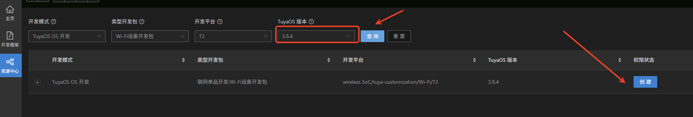<br><br>
- 创建会自动转跳至 `Tuya Wind IDE` 插件下的 `开发框架` 页面并跟随以下弹窗，点击t弹窗的 `完成`按钮即可。<br><br>
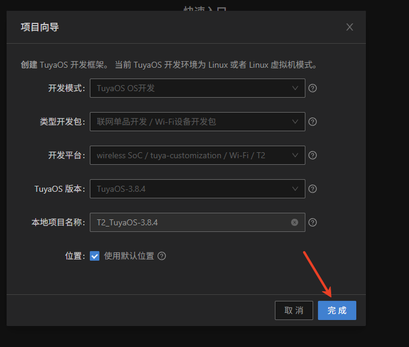

### 2. T2_TuyaOS-3.8.4 文件说明

```SH
T2_TuyaOS-3.8.4/                    # 项目根目录
├── hardware/                       # 硬件相关文档
│   └── T2/                         # T2硬件平台
│       └── module_manual/          # 模块手册
├── pc/                             # PC端工具
│   └── tools/                      # 开发工具集
│       └── T2/                     # T2专用工具
└── software/                       # 软件核心代码
    └── TuyaOS/                     # TuyaOS操作系统
        ├── apps/                   # 示例应用程序
        ├── build/                  # 编译配置
        ├── docs/                   # 开发文档
        ├── include/                # 头文件
        ├── libs/                   # 库文件
        ├── scripts/                # 工具脚本
        └── vendor/                 # 原厂库
```

### 3. 编译例程

TuyaOS 提供的 `apps` 文件夹中的历程如下：

```SH
├── apps
    │   │   ├── tuyaos_demo_application_driver    #硬件驱动demo
    │   │   ├── tuyaos_demo_examples              #示例应用程序 
    │   │   ├── tuyaos_demo_quickstart            #快速入门demo
    │   │   └── tuyaos_demo_wifi_qr_activate      #WiFi二维码激活demo
```

::: details 方式一:`鼠标右键`快捷方式编译
- 步骤1：在 `apps` 文件夹中，找到需要编译的历程文件夹，例如 `tuyaos_demo_quickstart`。
- 步骤2：在历程文件夹中，点击 `鼠标右键`，选择 `编译`，即可编译该历程,例如:

<center>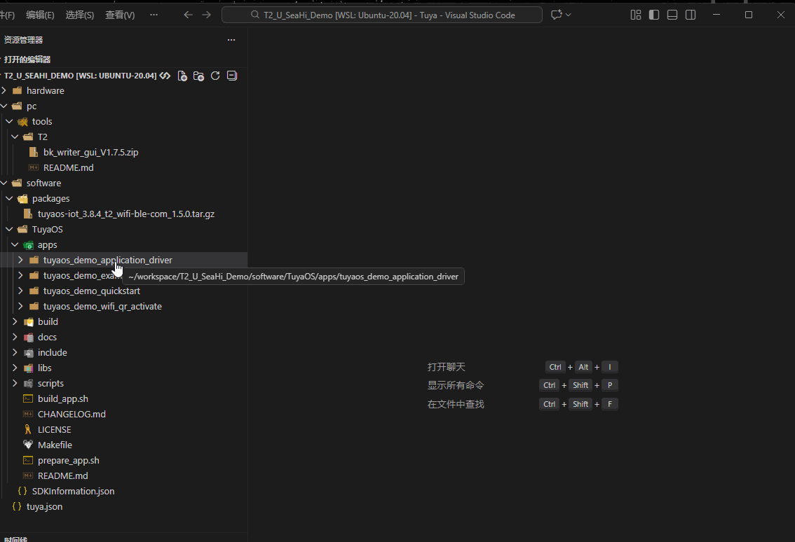</img></center>
:::

::: details 方式二: `build_app.sh` 脚本编译
- 步骤1：进入 `T2_TuyaOS-3.8.4/software/TuyaOS` 目录。
- 步骤2：在项目根目录中，打开终端，使用 `build_app.sh ` 脚本编译，例如编译 `tuyaos_demo_quickstart` 历程：
```SH
./build_app.sh apps/tuyaos_demo_quickstart tuyaos_demo_quickstart 1.0.0 
```
:::

::: details 方式三: `make` 指令编译
- 步骤1：进入 `T2_TuyaOS-3.8.4/software/TuyaOS` 目录。
- 步骤2：在项目根目录中，打开终端，使用 `make` 指令编译，例如编译 `tuyaos_demo_quickstart` 历程：
```SH
make 
```
:::

::: note 方式二和方式三的区别
1. 方式二可以指定编译的例程、版本号等参数。方式三编译的例程只能是方式二中配置好的，不能自定义。
2. 方式三 可以让用户自定义编译版本，方式三只能默认为 `1.0.0`。
3. 命令行编译推荐使用方式二。
:::

### 4. 下载固件

::: note 笔记
- 编译所生成的文件位于 `apps/xxxx/output/<版本号>` 目录下。
- 正式的固件的文件名格式为 `xxxx_QIO_<版本号>.bin`，例如 `tuyaos_demo_quickstart_QIO_1.0.0.bin`。
:::

- 步骤1：把T2-U 开发板的拨码开关的 `1`和 `2` 拨到 `ON` 位置。
- 步骤2：把T2-U 开发板的USB线插入电脑的USB接口，并映射到 WSL2 环境中。可参考：[安装WSL2](/tutorial/Linux/wsl_install#wsl2-串口映射) 的 "WSL2串口" 章节。
- 步骤3：在例程中，*`apps/xxxx/output/<版本号>`* 目录下，找到编译生成的固件文件，例如 `tuyaos_demo_quickstart_QIO_1.0.0.bin`。
- 步骤4：选中固件文件，点击 `鼠标右键`，选择 `Flash App`即可下载。
- 示例：

<center>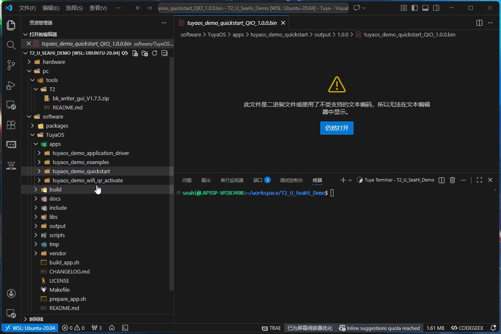</img></center>

### 5. 验证固件

- 步骤1：把T2-U 开发板的拨码开关的 `3`和 `4` 拨到 `OFF` 位置。
- 步骤2：底部菜单栏选择 `串行监视器` 或 `Serial Monitor`，即可打开串口监视器。
- 步骤3：在串口监视器中，端口选择 `/dev/ttyACM1`，波特率选择 `115200`，数据位为 `8`，无校验位，1 个停止位。
- 步骤4：点击`开始监视`
- 步骤5：复位 T2-U 开发板，即可看到开发板打印的信息。
- 示例：

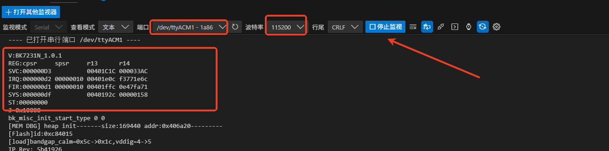</img>

## 常见问题

::: details 1. 编译失败 
- 问题描述：编译出现类似以下错误信息：
``` bash
clean application static ...
find: ‘apps/tuyaos_demo_quickstart/application_components’: No such file or directory
find: ‘apps/tuyaos_demo_quickstart/application_drivers’: No such file or directory
find: ‘apps/tuyaos_demo_quickstart/application_components’: No such file or directory
find: ‘apps/tuyaos_demo_quickstart/application_drivers’: No such file or directory
CC /home/seahi/workspase/T2_TuyaOS-3.8.4/software/TuyaOS/apps/tuyaos_demo_quickstart/src/app_led.c
In file included from /home/seahi/workspase/T2_TuyaOS-3.8.4/software/TuyaOS/apps/tuyaos_demo_quickstart/src/app_led.c:12:
include/components/tal_system/include/tal_log.h:14:10: fatal error: tuya_cloud_types.h: No such file or directory
   14 | #include "tuya_cloud_types.h"
```
- 编译失败的原因:`software/TuyaOS/vendor/t2/` 目录为空，导致 T2 库文件、编译工具等文件缺失。
- 解决方法：
  - 解压 `T2_TuyaOS-3.8.4/software/TuyaOS/vendor/t2_1.5.0.zip` 到 `software/TuyaOS/vendor/t2/` 目录下。
  - 安装 `unzip` 命令行工具。
  ```
  sudo apt install unzip
  ```
  - 进入 vendor 目录。
  ```
  cd vendor
  ```
  - 删除原先的 `t2/` 目录。
  ```
  rm -rf t2/
  ```
  - 解压 `t2_1.5.0.zip`
  ```
  unzip t2_1.5.0.zip 
  ```
  - 重命名 `t2_1.5.0_temp` 目录为 `t2`。
  ```
  mv t2_1.5.0_temp t2 
  ```
- 重新编译即可。
:::

## 快捷导航


::: navCard
```yaml
config:
    target: _self
data:
  - name: 编写第一个Tuya OS 应用
    desc: 实现打印 "Hello, Tuya!"
    link: /tutorial/tuya/oneapp
    img:  /svg/tuya.svg
    badge: 第三步
    badgeType: tip
  - name: 点亮一盏LED灯
    desc: 实现点亮开发板上的LED灯
    link: /tutorial/tuya/led
    img:  /svg/led.svg
    badge: 第四步
  - name: 连接WiFi
    desc: 实现开发板连接到WiFi网络
    link: /tutorial/tuya/wifi
    img:  /svg/Wi-Fi.svg
  #   badge: 第五步
  # - name: 实现连接 Tuya 开发者平台
  #   desc: 实现开发板连接到 Tuya 开发者平台
  #   link: /tutorial/tuya/connect
  #   img:  /svg/tuya.svg
  #   badge: 第六步
```
:::