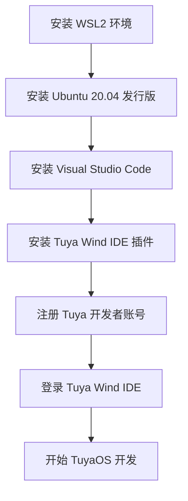

## 概述


TuyaOS 是 Tuya 公司开发的通用SDK，用于开发 Tuya 公司设计的模组。它提供了通用型的接口和功能，并兼容 Tuya 多款模组。<br>
而[Tuya Wind IDE](https://developer.tuya.com/cn/docs/iot-device-dev/tuyaos-wind-ide?id=Kbfy6kfuuqqu3) 是面向基于 TuyaOS 的开发者提供的一站式集成开发环境。<br>
它以 Visual Studio Code 插件形式发布，支持中英双语，通过 [涂鸦开发者平台](https://platform.tuya.com/) 账号登录。<br>
Tuya Wind IDE 统一管理、分发及更新 TuyaOS EasyGo 相关开发资料，提供了不同主机、不同开发工具下一致的开发体验。

::: navCard
```yaml

- name: TuyaOS
  desc: 涂鸦通用SDK
  link: https://developer.tuya.com/cn/docs/iot-device-dev/TuyaOS-Overview?id=Kbfjtwjcpn1gc
  img:  /svg/tuya.svg
  badge: 官方文档
  badgeType: tip
- name: Tuya Wind IDE
  desc: 一站式集成开发环境
  link: https://developer.tuya.com/cn/docs/iot-device-dev/tuyaos-wind-ide?id=Kbfy6kfuuqqu3
  img:  /svg/tuya.svg
  badge: 官方文档
  badgeType: tip
```
:::

::: note 笔记
- TuyaOS 的只能在 `Linux` 环境下编译，不支持 `Windows` 环境。
- 因为`Tuya Wind IDE` 是基于 Visual Studio Code 插件形式发布的，所以需要先安装 Visual Studio Code，再安装 `Tuya Wind IDE` 插件。
- 安装完成后，需要在 [涂鸦开发者平台](https://platform.tuya.com/) 注册账号才能登录使用。
- TuyaOS 的开发要在 `Tuya Wind IDE` 插件下进行
::: 


## 环境搭建流程

<center>


</center>

## 安装 WSL2 环境
::: navCard
```yaml
config:
    target: _self
data:

  - name: 安装 WSL2
    desc: 安装 Windows下的 Linux 子系统
    link: /tutorial/Linux/wsl_install
    img: /img/nav/WSL2.png
    badge: 方便快捷
```
:::
## 安装 Ubuntu 20.04 发行版
::: navCard
```yaml
config:
    target: _self
data:


  - name: 安装Ubuntu 20.04
    desc: 主流的 Linux 发行版
    link: /tutorial/Linux/ubuntu_install#wsl_ubuntu2024
    img:  /svg/ubuntu.svg
    badge: 小白必看
```
:::
## 安装 Visual Studio Code
::: navCard
```yaml
config:
    target: _self
data:
  - name: 安装VSCode
    desc: 代码编辑工具
    link: /tutorial/Linux/VScode_install
    img:  /img/nav/VSCode.png
    badge: 小白必看
```
:::


## 安装 Tuya Wind IDE 插件

- 步骤1：Visual Studio Code 先连接到 WSL2 环境，可参考：[连接 WSL](/tutorial/Linux/VScode_install#连接-wsl)
- 步骤2：在 Visual Studio Code 中安装 `Tuya Wind IDE` 插件。

<center>


</center>

## 注册 Tuya 开发者账号
点击下方连接注册 Tuya 开发者账号。
::: navCard
```yaml
data:
  - name: 注册 Tuya 开发者账号
    desc: Tuya 开发者账号页面
    link: https://auth.tuya.com/register?from=http%3A%2F%2Fplatform.tuya.com%2F
    img: /svg/tuya.svg
    badge: Tuya 开发者平台
```
:::

## 登录 Tuya Wind IDE
- 步骤1：在 Visual Studio Code 中点击 `Tuya Wind IDE` 插件图标，打开 `Tuya Wind IDE` 登录页面。


- 步骤2：在 `Tuya Wind IDE` 登录页面，输入之前注册的 Tuya 开发者账号邮箱和密码，点击登录。登录成功示例如下：


## 开始 TuyaOS 开发

### 1.搜索开发包

- 在 `Tuya Wind IDE` 的资源中心中，`开发模式` 选项选择 `TuyaOS OS 开发`。<br><br>
<br><br>
- `类型开发包` 选项选择 `Wi-Fi设备开发包`<br><br>
<br><br>
- `开发平台` 选项选择 `T2`<br><br>
<br><br>
- `TuyaOS 版本` 选项选择 `3.8.4`,点击 `查询`，查询到 `3.8.4` 版本的开发包，点击 `创建` 即可。<br><br>
<br><br>
- 创建会自动转跳至 `Tuya Wind IDE` 插件下的 `开发框架` 页面并跟随以下弹窗，点击t弹窗的 `完成`按钮即可。<br><br>


### 2. 编译例程
