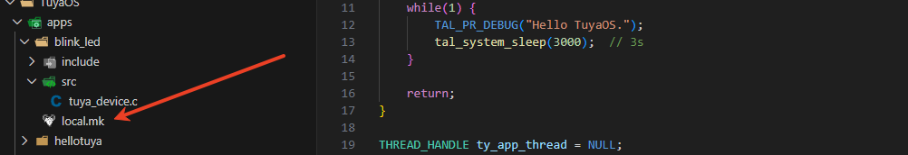
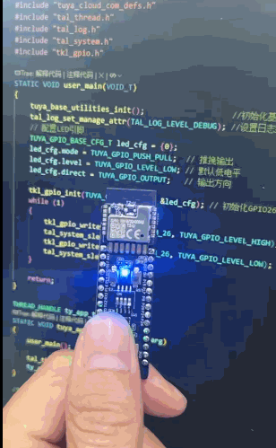

## 新建 LED 工程

1. 和上一节一样，我们也需要新建一个工程，工程名称为 `blink_led`。
2. 复制 `helloytuya` 工程中的 `local.mk` 文件到 `blink_led` 工程目录下。<br><br>

<center>


</center>

## 配置 LED 引脚

1. 同样的，添加 `tuya_base_utilities_init();` 和 ` tal_log_set_manage_attr(TAL_LOG_LEVEL_DEBUG)` 函数
   
``` C
STATIC VOID user_main(VOID_T)
{
    tuya_base_utilities_init();  //[!code focus] 初始化基础组件
    tal_log_set_manage_attr(TAL_LOG_LEVEL_DEBUG);      //[!code focus] 设置日志级别
    while(1) {
        TAL_PR_DEBUG("Hello TuyaOS.");
        tal_system_sleep(3000);  // 3s
    }

    return;
}
```
2. 根据 T2-U 开发板的LED引脚（[点此查看开发板框图](/tutorial/tuya/t2board#引脚及接口)），LED 的引脚在 `P26`。<br><br>
3. 引用 gpio 头文件 `#include "tkl_gpio.h"`
4. 初始化 LED 引脚为输出模式,默认低电平（低电平点亮LED）,此时可以编译烧录验证一下，代码如下：

``` C
STATIC VOID user_main(VOID_T)
{
    tuya_base_utilities_init();                   
    tal_log_set_manage_attr(TAL_LOG_LEVEL_DEBUG); 
    // 配置LED引脚
    TUYA_GPIO_BASE_CFG_T led_cfg = {0};   //[!code focus] 创建LED引脚配置结构体
    led_cfg.mode = TUYA_GPIO_PUSH_PULL;  //[!code focus] 推挽输出
    led_cfg.level = TUYA_GPIO_LEVEL_LOW; //[!code focus] 默认低电平
    led_cfg.direct = TUYA_GPIO_OUTPUT;   //[!code focus] 输出方向
   tkl_gpio_init(TUYA_GPIO_NUM_26, &led_cfg);//[!code focus] 初始化GPIO26

    while (1)
    {
        TAL_PR_DEBUG("Hello TuyaOS.");
        tal_system_sleep(3000); // 3s
    }

    return;
}

```

## 编写闪烁任务
1. 删除 `while(1) { ... }` 循环中的日志打印语句。
2. 在 `user_main` 函数中添加闪烁代码，代码如下：
``` C
STATIC VOID user_main(VOID_T)
{
    tuya_base_utilities_init();                   
    tal_log_set_manage_attr(TAL_LOG_LEVEL_DEBUG); 
    // 配置LED引脚
    TUYA_GPIO_BASE_CFG_T led_cfg = {0};   //[!code focus] 创建LED引脚配置结构体
    led_cfg.mode = TUYA_GPIO_PUSH_PULL;  //[!code focus] 推挽输出
    led_cfg.level = TUYA_GPIO_LEVEL_LOW; //[!code focus] 默认低电平
    led_cfg.direct = TUYA_GPIO_OUTPUT;   //[!code focus] 输出方向
   tkl_gpio_init(TUYA_GPIO_NUM_26, &led_cfg);//[!code focus] 初始化GPIO26
    // 闪烁任务
    while (1)
    {
        tkl_gpio_write(TUYA_GPIO_NUM_26, TUYA_GPIO_LEVEL_HIGH); //[!code focus] 高电平，LED熄灭
        tal_system_sleep(500); // 500ms
        tkl_gpio_write(TUYA_GPIO_NUM_26, TUYA_GPIO_LEVEL_LOW);  //[!code focus] 低电平，LED点亮
        tal_system_sleep(500); // 500ms
    }

    return;
}

```
## 烧录验证
1. 编译并烧录代码到开发板。
2. 开发板上的LED灯应该开始闪烁了。效果如下：

<center>


</center>


<!-- ::: navCard
```yaml
config:
    target: _self
data:
  - name: 连接WiFi
    desc: 实现开发板连接到WiFi网络
    link: /tutorial/tuya/wifi
    img:  /svg/Wi-Fi.svg
    badge: 第五步
    badgeType: tip
  - name: 实现连接 Tuya 开发者平台
    desc: 实现开发板连接到 Tuya 开发者平台
    link: /tutorial/tuya/connect
    img:  /svg/tuya.svg
    badge: 第六步
```
::: -->