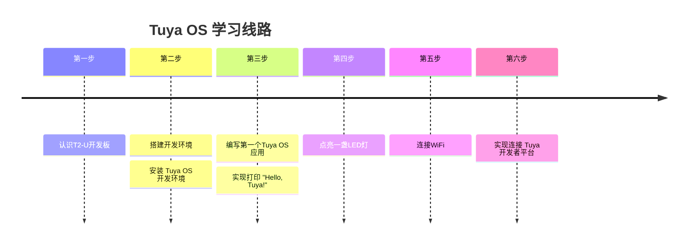

## 概述

本教程将以 T2 开发板为基础，介绍 Tuya OS 的开发流程和技能。首先大家要有一个基本的认知:

::: note Tuya OS 它是开发版和Tuya 开发者平台绑定的，开发板的所有精髓是接入Tuya 开发者平台。
:::

<center>


</center>



## 快捷导航


::: navCard
```yaml
config:
    target: _self
data:
  - name: Tuya T2-U 开发板介绍
    desc: Tuya T2-U 开发板是 Tuya 公司推出的一款基于 ESP32 芯片的开发板，它集成了 Wi-Fi、蓝牙、传感器等功能，是 Tuya 开发者平台的基础。
    link: /tutorial/tuya/t2board
    img:  /svg/board.svg
    badge: 第一步
    badgeType: tip
  - name: 安装开发环境
    desc: 安装 Tuya OS 开发环境
    link: /tutorial/tuya/osinstall
    img: /svg/install.svg
    badge: 第二步
  - name: 编写第一个Tuya OS 应用
    desc: 实现打印 "Hello, Tuya!"
    link: /tutorial/tuya/oneapp
    img:  /svg/tuya.svg
    badge: 第三步
  - name: 点亮一盏LED灯
    desc: 实现点亮开发板上的LED灯
    link: /tutorial/tuya/led
    img:  /svg/led.svg
    badge: 第四步
  - name: 连接WiFi
    desc: 实现开发板连接到WiFi网络
    link: /tutorial/tuya/wifi
    img:  /svg/Wi-Fi.svg
    badge: 第五步
  - name: 实现连接 Tuya 开发者平台
    desc: 实现开发板连接到 Tuya 开发者平台
    link: /tutorial/tuya/connect
    img:  /svg/tuya.svg
    badge: 第六步
```
:::