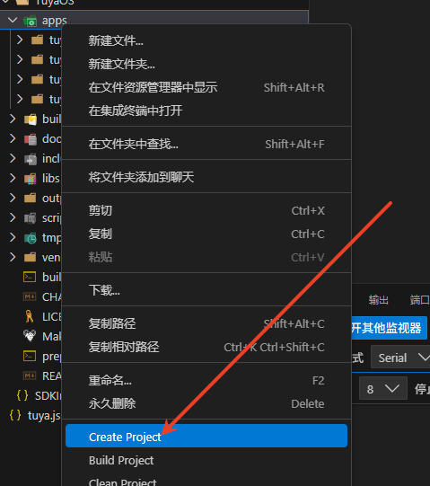
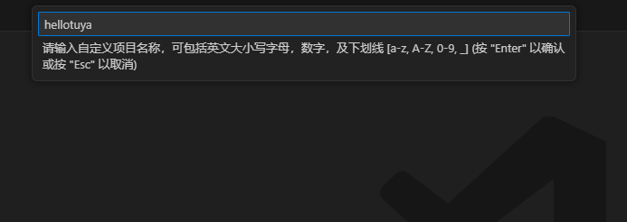
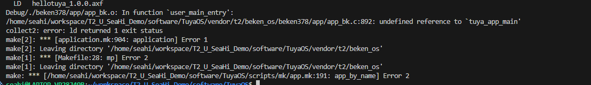
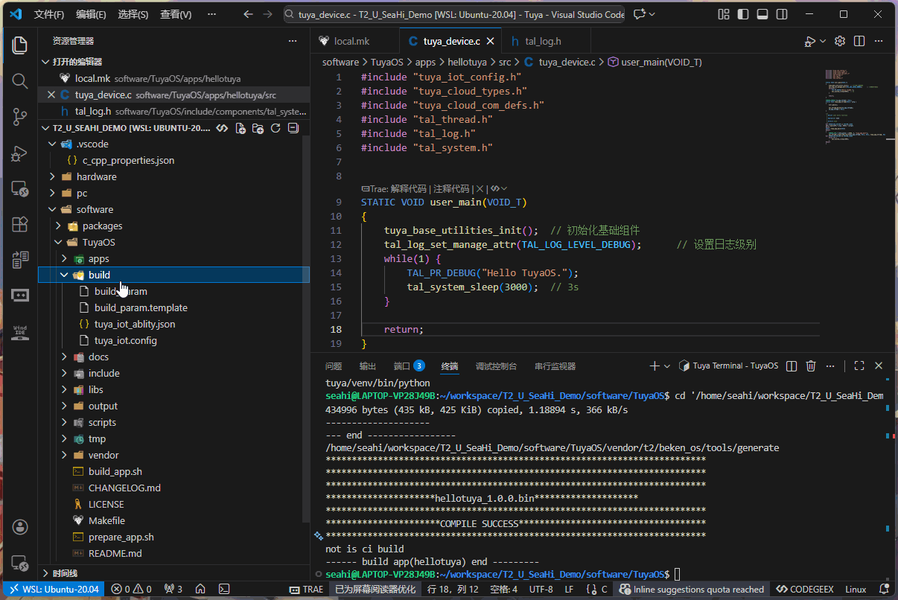
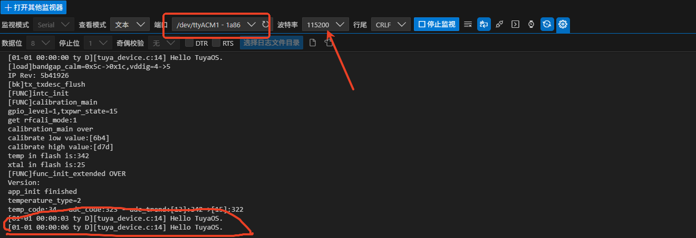

## 创建新的应用

- 选中 `apps` 文件夹后使用 `鼠标右键` 展开菜单，选择 `Create Project` 创建一个新文件夹，命名为 `hellotuya`。

<center><div style="display: flex; flex-wrap: wrap; gap: 20px; padding: 0 10px;">
  <!-- 第一张图片 -->
  <div style="flex: 1; min-width: 100px; padding: 15px; border-radius: 8px; display: flex; align-items: center; justify-content: center;">
    
  </div>

  <div style="flex: 1; min-width: 100px; padding: 15px; border-radius: 8px; display: flex; align-items: flex-start; justify-content: center;">
    
  </div>
</div></center>

::: note 笔记
提示说可以大写字母，但是实际上工程名称只能是小写字母、下划线和数字，不能包含空格或特殊字符。
:::

## 编写 "Hello, tuya!"

### 步骤1 

给 `hellotuya` 工程添加一个 local.mk 文件，并添加以下内容：

``` Makefile
# 当前文件所在目录
LOCAL_PATH := $(call my-dir)

#---------------------------------------

# 清除 LOCAL_xxx 变量
include $(CLEAR_VARS)

# 当前模块名
LOCAL_MODULE := $(notdir $(LOCAL_PATH))

# 模块对外头文件（只能是目录）
# 加载至CFLAGS中提供给其他组件使用；打包进SDK产物中；
LOCAL_TUYA_SDK_INC := $(LOCAL_PATH)/include
ifneq ($(APP_PACK_FLAG), 1) 

endif

# 模块对外CFLAGS：其他组件编译时可感知到
LOCAL_TUYA_SDK_CFLAGS := -DUSER_SW_VER=\"$(APP_VER)\" -DAPP_BIN_NAME=\"$(APP_NAME)\"

# 模块源代码
LOCAL_SRC_FILES := $(shell find $(LOCAL_PATH)/src -name "*.c" -o -name "*.cpp" -o -name "*.cc")


# 模块内部CFLAGS：仅供本组件使用
LOCAL_CFLAGS :=

# 全局变量赋值
TUYA_SDK_INC += $(LOCAL_TUYA_SDK_INC)  # 此行勿修改
TUYA_SDK_CFLAGS += $(LOCAL_TUYA_SDK_CFLAGS)  # 此行勿修改

# 生成静态库
include $(BUILD_STATIC_LIBRARY)

# 生成动态库
include $(BUILD_SHARED_LIBRARY)

# 导出编译详情
include $(OUT_COMPILE_INFO)

#---------------------------------------
```

::: warning 警告
如果没有这个文件，编译时会报错。如：

:::

### 步骤2
- 在 `src` 文件夹下的 `tuya_device.c` 文件找到 `user_main` 函数(在文件中的第9行)，添加以下函数：
``` C
STATIC VOID user_main(VOID_T)
{
    tuya_base_utilities_init();  //[!code focus] 初始化基础组件
    tal_log_set_manage_attr(TAL_LOG_LEVEL_DEBUG);      //[!code focus] 设置日志级别
    while(1) {
        TAL_PR_DEBUG("Hello TuyaOS.");
        tal_system_sleep(3000);  // 3s
    }

    return;
}
```

## 编译并烧录应用

- 编译工程：选中 `hellotuya` 工程文件夹后，按 `鼠标右键`，选择`Build Project`：
- 烧录应用：在 `hellotuya` 工程文件夹中的 `output` 文件夹，选择 `hellotuya_QIO_v1.0.0.bin` 文件，按 `鼠标右键`，选择`Flash App`，选择对应的串口，如 `/dev/ttyACM0`.
- 示例：

 <div style="flex: 1; min-width: 100px; padding: 15px; border-radius: 8px; display: flex; align-items: flex-start; justify-content: center;">
    
  </div>

## 验证

- VSCode 的 `串行监视器` 或 `Serial Monitor` 工具，选择对应的串口，如 `/dev/ttyACM1`，波特率 115200。
- 按键开发板的 `RST` 按钮，开发板会输出 `Hello TuyaOS.` 日志。如：

 <div style="flex: 1; min-width: 100px; padding: 15px; border-radius: 8px; display: flex; align-items: flex-start; justify-content: center;">
    
  </div>
  
::: navCard
```yaml
config:
    target: _self
data:
  - name: 点亮一盏LED灯
    desc: 实现点亮开发板上的LED灯
    link: /tutorial/tuya/led
    img:  /svg/led.svg
    badge: 第四步
    badgeType: tip
  - name: 连接WiFi
    desc: 实现开发板连接到WiFi网络
    link: /tutorial/tuya/wifi
    img:  /svg/Wi-Fi.svg
    badge: 第五步
  - name: 实现连接 Tuya 开发者平台
    desc: 实现开发板连接到 Tuya 开发者平台
    link: /tutorial/tuya/connect
    img:  /svg/tuya.svg
    badge: 第六步
```
:::
