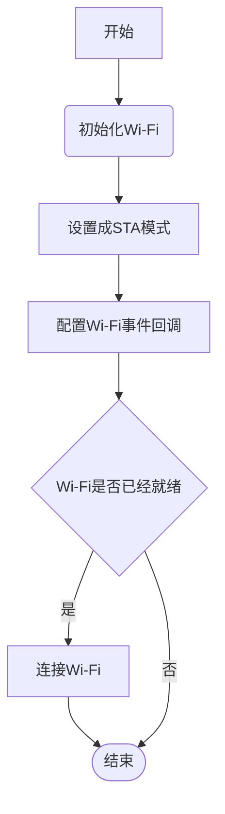
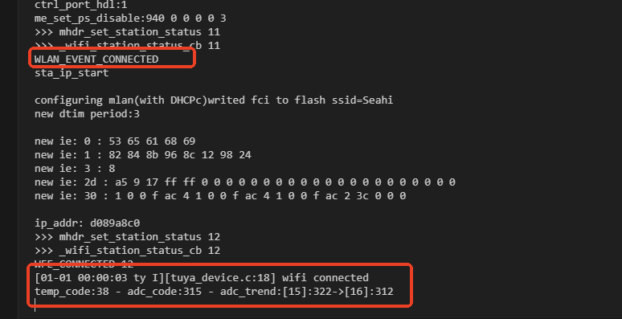

## 概述

为什么不继续写其他外设的编程？<br>
原因有三：<br>
1. 涂鸦的模组需要连接到涂鸦开放平台才是精髓
2. 其他外设会在做应用项目时再编写教程
3. T2-U 开发板是一款WiFi+BLE 的模组，无线功能才是重点

接下来正式进入 T2-U 开发板的无线功能编程部分，从本章开始，我们才算真正入门涂鸦开放平台。

## 实现思路
- 本章不会新建工程了，沿用之前的工程，在 `blink_led` 工程的基础上进行修改
- 本章我们会全程参考 tuya 开发者平台的文档，实现开发板连接到WiFi网络，关于 WiFi 编程指南的快捷方式如下：

::: navCard
```yaml

- name: TuyaOS-WiFi
  desc: 涂鸦通用SDK
  link: https://developer.tuya.com/cn/docs/iot-device-dev/TuyaOS-iot_abi_driver_wifi?id=Kcusut0tv85ee
  img:  /svg/tuya.svg
  badge: 官方文档
  badgeType: tip
```
:::

<center>


</center>


## 初始化Wi-Fi

1. 打开 `blink_led/src/tuya_device.c` 文件
2. 引用 Wi-Fi 相关的头文件：`tuya_iot_wifi_api.h`
3. 先把 LWIP 初始化 
4. 创建一个回调函数 `user_wifi_event_cb`，用于处理 WiFi 事件
5. 在 `user_main` 函数中初始化 WiFi 模块：`tkl_wifi_init(user_wifi_event_cb)`
- 代码如下（编译没报错就可下一步）：

```c
#include "tuya_iot_config.h"
#include "tuya_cloud_types.h"
#include "tuya_cloud_com_defs.h"
#include "tal_thread.h"
#include "tal_log.h"
#include "tal_system.h"
#include "tkl_gpio.h"
#include "tuya_iot_wifi_api.h" //[!code focus][!code ++] wifi相关接口

STATIC VOID_T user_wifi_event_cb(WF_EVENT_E event, VOID_T *arg)//[!code focus][!code ++]
{//[!code focus][!code ++]
//[!code ++]
}//[!code focus][!code ++]

STATIC VOID user_main(VOID_T)//[!code focus]
{//[!code focus]
    tuya_base_utilities_init();                   //初始化基础组件
    tal_log_set_manage_attr(TAL_LOG_LEVEL_DEBUG); //设置日志级别
    // 配置LED引脚
    TUYA_GPIO_BASE_CFG_T led_cfg = {0};
    led_cfg.mode = TUYA_GPIO_PUSH_PULL;  // 推挽输出
    led_cfg.level = TUYA_GPIO_LEVEL_LOW; // 默认低电平
    led_cfg.direct = TUYA_GPIO_OUTPUT;   // 输出方向
    tkl_gpio_init(TUYA_GPIO_NUM_26, &led_cfg); // 初始化GPIO26
#if defined(ENABLE_LWIP) && (ENABLE_LWIP == 1)//[!code focus][!code ++]
    TUYA_LwIP_Init();//[!code focus][!code ++]
#endif//[!code focus][!code ++]
    tkl_wifi_init(user_wifi_event_cb); //[!code focus][!code ++] 初始化wifi
    while (1)
    {
        tkl_gpio_write(TUYA_GPIO_NUM_26, TUYA_GPIO_LEVEL_HIGH);
        tal_system_sleep(500);
        tkl_gpio_write(TUYA_GPIO_NUM_26, TUYA_GPIO_LEVEL_LOW);
        tal_system_sleep(500);
    }

    return;
}//[!code focus]
```
## 设置成STA模式

Wi-Fi 设备有AP和STA模式之分，AP 模式是指设备作为一个热点，其他设备可以连接到该热点；STA 模式是指设备作为一个客户端，连接到已有的热点。<br>
我们需要把 T2-U 开发板设置成 STA 模式，才能连接到自己的路由器。<br>
- 代码如下（编译没报错就可下一步）：
```c
tkl_wifi_set_work_mode(WWM_STATION);
```

## 配置WiFi事件回调

TuyaOS 的文档当中，并没有详细介绍 `WF_EVENT_E` 事件，我们需要自己去查看 `tuya_iot_wifi_api.h` 文件，介绍如下：
::: note WF_EVENT_E 事件类型说明
- WFE_CONNECTED: WiFi连接成功
- WFE_CONNECT_FAILED: WiFi连接失败
- WFE_DISCONNECTED: WiFi断开连接
:::

所以，我们需要在 `user_wifi_event_cb` 函数中处理这三个事件，代码如下：

```c
STATIC VOID_T user_wifi_event_cb(WF_EVENT_E event, VOID_T *arg)
{
    switch (event)//[!code focus][!code ++]
    {//[!code focus][!code ++]
    case WFE_CONNECTED://[!code focus][!code ++]
        TAL_PR_INFO("wifi connected");//[!code focus][!code ++]
        break;//[!code focus][!code ++]
    case WFE_CONNECT_FAILED://[!code focus][!code ++]
        TAL_PR_INFO("wifi connect failed");//[!code focus][!code ++]
        break;//[!code focus][!code ++]
    case WFE_DISCONNECTED://[!code focus][!code ++]
        TAL_PR_INFO("wifi disconnected");//[!code focus][!code ++]
        break;//[!code focus][!code ++]
    default://[!code focus][!code ++]
        break;//[!code focus][!code ++]
    }//[!code focus][!code ++]
}
```

## 连接Wi-Fi

1. 创建两个宏定义，分别代表 Wi-Fi 名称和密码
2. 调用 `tkl_wifi_station_connect` 函数连接到指定的 Wi-Fi 网络
- 代码如下：
```c
#include "tuya_iot_config.h"
#include "tuya_cloud_types.h"
#include "tuya_cloud_com_defs.h"
#include "tal_thread.h"
#include "tal_log.h"
#include "tal_system.h"
#include "tkl_gpio.h"
#include "tuya_iot_wifi_api.h" // wifi相关接口

#define SSID "Seahi"//[!code focus][!code ++]
#define PASSWORD "12345678"//[!code focus][!code ++]
// 此处省略已展示的部分代码
STATIC VOID user_main(VOID_T)
{
    tuya_base_utilities_init();                   // 初始化基础组件
    tal_log_set_manage_attr(TAL_LOG_LEVEL_DEBUG); // 设置日志级别
    // 配置LED引脚
    TUYA_GPIO_BASE_CFG_T led_cfg = {0};
    led_cfg.mode = TUYA_GPIO_PUSH_PULL;        // 推挽输出
    led_cfg.level = TUYA_GPIO_LEVEL_LOW;       // 默认低电平
    led_cfg.direct = TUYA_GPIO_OUTPUT;         // 输出方向
    tkl_gpio_init(TUYA_GPIO_NUM_26, &led_cfg); // 初始化GPIO26

#if defined(ENABLE_LWIP) && (ENABLE_LWIP == 1)
    TUYA_LwIP_Init();
#endif

    tkl_wifi_init(user_wifi_event_cb);         // 初始化wifi
    tkl_wifi_set_work_mode(WWM_STATION);       // 设置wifi工作模式为STA
    tkl_wifi_station_connect(SSID, PASSWORD); // 连接Wi-Fi//[!code focus][!code ++]

    while (1)
    {
        tkl_gpio_write(TUYA_GPIO_NUM_26, TUYA_GPIO_LEVEL_HIGH);
        tal_system_sleep(500);
        tkl_gpio_write(TUYA_GPIO_NUM_26, TUYA_GPIO_LEVEL_LOW);
        tal_system_sleep(500);
    }
    return;
}

```

## 烧录验证

1. 编译`blink_led` 工程，版本为: 1.0.0
2. 烧录到 T2-U 开发板
3. 打开串口工具，选择 *`/dev/ttyACM1`* 设置波特率为 115200，数据位为 8 位，无校验位，1 个停止位
4. 开发板上的 LED 灯开始闪烁，并在串口工具中打印出连接成功的日志：

<center>


</center>

## 扩展示例

::: details LED 指示 WiFi 状态（断开持续快闪，连接定时闪烁）
```c
#include "tuya_iot_config.h"
#include "tuya_cloud_types.h"
#include "tuya_cloud_com_defs.h"
#include "tal_thread.h"
#include "tal_log.h"
#include "tal_system.h"
#include "tkl_gpio.h"
#include "tuya_iot_wifi_api.h" // wifi相关接口

#define SSID "*****" // Wi-Fi名称
#define PASSWORD "12345678" // Wi-Fi密码

BOOL_T user_wifi_status = FALSE; // wifi状态
STATIC VOID_T user_wifi_event_cb(WF_EVENT_E event, VOID_T *arg)
{
    switch (event)
    {
    case WFE_CONNECTED:
        TAL_PR_INFO("wifi connected");
        user_wifi_status = TRUE;
        break;
    case WFE_CONNECT_FAILED:
        TAL_PR_INFO("wifi connect failed");
        user_wifi_status = FALSE;
        break;
    case WFE_DISCONNECTED:
        TAL_PR_INFO("wifi disconnected");
        user_wifi_status = FALSE;
        break;
    default:
        break;
    }
}

STATIC VOID user_main(VOID_T)
{
    tuya_base_utilities_init();                   // 初始化基础组件
    tal_log_set_manage_attr(TAL_LOG_LEVEL_DEBUG); // 设置日志级别
    // 配置LED引脚
    TUYA_GPIO_BASE_CFG_T led_cfg = {0};
    led_cfg.mode = TUYA_GPIO_PUSH_PULL;        // 推挽输出
    led_cfg.level = TUYA_GPIO_LEVEL_LOW;       // 默认低电平
    led_cfg.direct = TUYA_GPIO_OUTPUT;         // 输出方向
    tkl_gpio_init(TUYA_GPIO_NUM_26, &led_cfg); // 初始化GPIO26

#if defined(ENABLE_LWIP) && (ENABLE_LWIP == 1)
    TUYA_LwIP_Init();
#endif

    tkl_wifi_init(user_wifi_event_cb);         // 初始化wifi
    tkl_wifi_set_work_mode(WWM_STATION);       // 设置wifi工作模式为STA
    tkl_wifi_set_country_code(COUNTRY_CODE_CN);
    tkl_wifi_station_connect(SSID, PASSWORD); // 连接wifi

    while (1)
    {
        if (user_wifi_status == TRUE){
            tal_system_sleep(2000);
            tkl_gpio_write(TUYA_GPIO_NUM_26, TUYA_GPIO_LEVEL_LOW);
            tal_system_sleep(80);
            tkl_gpio_write(TUYA_GPIO_NUM_26, TUYA_GPIO_LEVEL_HIGH);
            tal_system_sleep(80);
        } 
        tkl_gpio_write(TUYA_GPIO_NUM_26, TUYA_GPIO_LEVEL_LOW);
        tal_system_sleep(user_wifi_status == TRUE ? 80 : 200);
        tkl_gpio_write(TUYA_GPIO_NUM_26, TUYA_GPIO_LEVEL_HIGH);
        tal_system_sleep(user_wifi_status == TRUE ? 80 : 200);
    }
    return;
}

THREAD_HANDLE ty_app_thread = NULL;
STATIC VOID tuya_app_thread(VOID_T *arg)
{
    user_main();

    tal_thread_delete(ty_app_thread);
    ty_app_thread = NULL;
}

/**
 * @brief user entry function
 *
 * @param[in] none
 *
 * @return none
 */
#if OPERATING_SYSTEM == SYSTEM_LINUX
INT_T main(INT_T argc, CHAR_T **argv)
#else
VOID_T tuya_app_main(VOID)
#endif
{
    THREAD_CFG_T thrd_param = {4096, 4, "tuya_app_main"};
    tal_thread_create_and_start(&ty_app_thread, NULL, NULL, tuya_app_thread, NULL, &thrd_param);
#if OPERATING_SYSTEM == SYSTEM_LINUX
    while (1)
    {
        tal_system_sleep(1000);
    }
#endif
}
```
:::