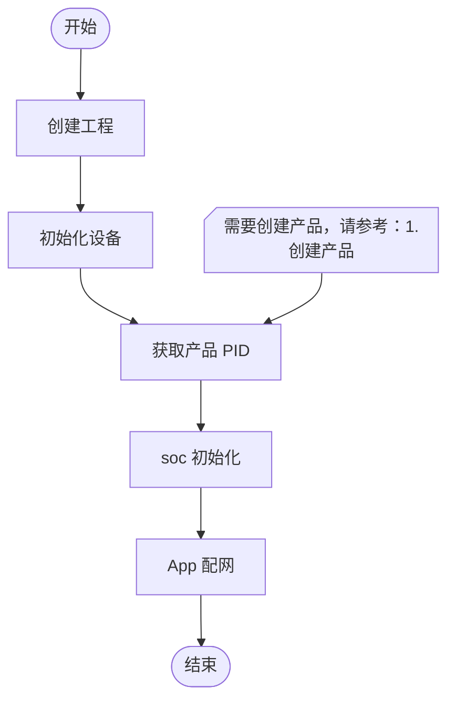

## 前言

::: note 什么是配网?
配网就是配置网络，也就是配置 Wi-Fi 名称和密码。与之前连接 Wi-Fi 的 demo 不同，配网需要进行动态配置。主流的配网方式主要有三种：
- `蓝牙配网`：通过模组的 BLE 蓝牙功能，与手机 App 进行交互，向模组发送Wi-Fi 名称和密码，实现配网操作。
- `AP 配网`：也叫热点配网，模组模拟一个Wi-Fi 热点，手机 App 连接该热点后，通过浏览器访问模组的 IP 地址，配置 Wi-Fi 名称和密码。
- `声波配网`：通过模组的声波功能，与手机 App 进行交互，配置 Wi-Fi 名称和密码,但是它需要麦克风和扬声器支持。
::: warning 注意
所有的配网功能都需要下载 Tuya 的 "智能生活" App。
:::

TuyaOS 提供了多种配网方式，包括蓝牙配网、AP 配网和声波配网等。其中 AP 配网和 Smart Config 是最常用的两种配网方式。本章主要讲解 Smart Config 的实现。接下来让我们一起了解如何使用 App 进行配网。

::: navCard
```yaml
data:
  - name: 配网模式
    desc: 实现 App 发现设备并配置 Wi-Fi
    link: https://developer.tuya.com/cn/docs/iot-device-dev/TuyaOS-iot_abi_network_config_mode?id=Kc67tro6mzaz0
    img:  /svg/tuya.svg
    badge: Tuya
    badgeType: tip
```
:::

## 极简实现流程

<center>


</center>

## 配网实现

### 步骤一：新建工程

和之前一样，新建一个工程，重命名为 *`net_config`*，在 *tuya_device.c* 文件引用头文件 *`tuya_iot_wifi_api.h`* 、 *`tuya_error_code.h`*和 *`tuya_cloud_wifi_defs.h`*。

```C
#include "tuya_iot_config.h"
#include "tuya_cloud_types.h"
#include "tuya_cloud_com_defs.h"
#include "tal_thread.h"
#include "tal_log.h"
#include "tal_system.h"
#include <tuya_cloud_wifi_defs.h>//[!code focus][!code ++]
#include <tuya_error_code.h>//[!code focus][!code ++]
#if defined(ENABLE_WIFI_SERVICE) && (ENABLE_WIFI_SERVICE == 1)//[!code focus][!code ++]
#include "tuya_iot_wifi_api.h"//[!code focus][!code ++]
#endif//[!code focus][!code ++]
```

### 步骤二：初始化设备

在 tuya_app_thread 函数中添加以下代码，完成设备初始化工作:

```C
STATIC VOID tuya_app_thread(VOID_T *arg)
{
    // 完成一些初始化工作
    OPERATE_RET rt = OPRT_OK;//[!code focus][!code ++]
#if defined(ENABLE_LWIP) && (ENABLE_LWIP == 1)//[!code focus][!code ++]
    TUYA_LwIP_Init();//[!code focus][!code ++]
#endif//[!code focus][!code ++]
    ws_db_init_mf();//[!code focus][!code ++] 初始化KV
    //[!code focus][!code ++] TuyaOS 设备初始化
    TY_INIT_PARAMS_S init_param = {0};//[!code focus][!code ++] 初始化参数
    init_param.init_db = TRUE;//[!code focus][!code ++] 
    strcpy(init_param.sys_env, TARGET_PLATFORM);//[!code focus][!code ++]
    TUYA_CALL_ERR_LOG(tuya_iot_init_params(NULL, &init_param));//[!code focus][!code ++]
    user_main();

    tal_thread_delete(ty_app_thread);
    ty_app_thread = NULL;
}
```
### 步骤三：获取产品 PID

``` steps
- icon: "/svg/set.svg"
  title: "第1步"
  text: "登录到[涂鸦开发者平台](https://iot.tuya.com)。"

- icon: "/svg/chaxun.svg"
  title: "第2步"
  text: "1.点击 “产品开发” ；<br> 2.点击上一章创建好的 “T2-U 台灯”。"
  image: "/img/tuya/netconfig/step2.png"
  alt: "无效图片"
- icon: "/svg/copy.svg"
  title: "第3步"
  text: "在 “T2-U 台灯” 页面中复制 “PID”。"
  image: "/img/tuya/netconfig/step3.png"
  alt: "无效图片"
```
将获取到的产品 PID 在代码中定义为宏，该宏会在后续代码中使用：
```C
#define PRODUCT_PID "YOUR_PRODUCT_PID" // 替换为你的产品 PID
```
### 步骤四：SOC初始化

添加以下代码完成 SOC 初始化:
```C
    TY_IOT_CBS_S iot_cbs = {0};
#ifdef ENABLE_WIFI_SERVICE
    TUYA_CALL_ERR_RETURN(tuya_iot_wf_soc_dev_init(GWCM_OLD, WF_START_SMART_FIRST, &iot_cbs, PRODUCT_PID, USER_SW_VER));
#endif

```
::: note tuya_iot_wf_soc_dev_init 参数说明

- `GWCM_OLD`：使用默认的上电配网模式
- `WF_START_SMART_FIRST`：优先使用Smart Config模式
- `&iot_cbs`：回调函数指针，用于处理配网过程中的事件回调,这里暂时不处理
- `PRODUCT_PID`：产品 PID
- `USER_SW_VER`：用户软件版本

:::

::: info PID 的作用
PID 用于标识不同的产品，在 App 添加设备是，App 会根据 PID 来判断产品的名称，从而显示在设备列表中。
:::

### 步骤五：烧录

根据之前的教程进行烧录即可，这里不再赘述。可参考：[编写应用：编译并烧录应用](/tutorial/tuya/oneapp#编译并烧录应用)

### 步骤六：App 配网

```steps
- icon: "/svg/new.svg"
  title: "第一步"
  text: "打开智能生活 App（通常会自动识别 T2-U 台灯产品）。如果未识别到，请查看下一步。"
  image: "/img/tuya/netconfig/step1_1.png"
  alt: "无效图片"

- icon: "/svg/set.svg"
  title: "第二步"
  text: "1.App 首页的 “+” 按钮；<br> 2.点击 “添加设备”；"
  image: "/img/tuya/netconfig/step1_2.png"
  alt: "无效图片"
- icon: "/svg/set.svg"
  title: "第三步"
  text: "在列表中找到 T2-U 台灯；<br> 选择设备，进入配网界面。"
  image: "/img/tuya/netconfig/step1_3.png"
  alt: "无效图片"
- icon: "/svg/set.svg"
  title: "第四步"
  text: "1.选择 Wi-Fi 网络；<br> 2.输入 Wi-Fi 密码；<br> 3.点击 “下一步”。"
  image: "/img/tuya/netconfig/step1_4.png"
  alt: "无效图片"

- icon: "/svg/wating.svg"
  title: "第五步"
  text: "1.点击 “完成”；<br> 2.等待设备连接到 Wi-Fi 网络。"
  image: "/img/tuya/netconfig/step1_5.png"
  alt: "无效图片"

- icon: "/svg/ok.svg"
  title: "第六步"
  text: "配网成功之后，就能在首页看到配网成功的设备了。"
  image: "/img/tuya/netconfig/step1_6.png"
  alt: "无效图片"
```
## 完整代码

::: details 完整代码
``` C 
#include "tuya_iot_config.h"
#include "tuya_cloud_types.h"
#include "tuya_cloud_com_defs.h"
#include "tal_thread.h"
#include "tal_log.h"
#include "tal_system.h"
#include <tuya_cloud_wifi_defs.h>
#include <tuya_error_code.h>
#if defined(ENABLE_WIFI_SERVICE) && (ENABLE_WIFI_SERVICE == 1)
#include "tuya_iot_wifi_api.h"
#endif

#define PRODUCT_PID "kkm3fmuawqr1g08e"

STATIC VOID user_main(VOID_T)
{

    while (1)
    {
        TAL_PR_DEBUG("Hello TuyaOS.");
        tal_system_sleep(3000); // 3s
    }

    return;
}

THREAD_HANDLE ty_app_thread = NULL;
STATIC VOID tuya_app_thread(VOID_T *arg)
{
    // 完成一些初始化工作
    OPERATE_RET rt = OPRT_OK;
#if defined(ENABLE_LWIP) && (ENABLE_LWIP == 1)
    TUYA_LwIP_Init();
#endif
    // ws_db_init_mf();
    // TuyaOS 设备初始化
    TY_INIT_PARAMS_S init_param = {0};
    init_param.init_db = TRUE;
    strcpy(init_param.sys_env, TARGET_PLATFORM);
    TUYA_CALL_ERR_LOG(tuya_iot_init_params(NULL, &init_param));
    // soc 初始化
    TY_IOT_CBS_S iot_cbs = {0};
#ifdef ENABLE_WIFI_SERVICE
    TUYA_CALL_ERR_RETURN(tuya_iot_wf_soc_dev_init(GWCM_OLD, WF_START_SMART_FIRST, &iot_cbs, PRODUCT_PID, USER_SW_VER));
#endif
    // 重置接口，触发配网
    // tuya_iot_wf_gw_unactive();

    // 执行用户主函数
    user_main();

    tal_thread_delete(ty_app_thread);
    ty_app_thread = NULL;
}

/**
 * @brief user entry function
 *
 * @param[in] none
 *
 * @return none
 */
#if OPERATING_SYSTEM == SYSTEM_LINUX
INT_T main(INT_T argc, CHAR_T **argv)
#else
VOID_T tuya_app_main(VOID)
#endif
{
    THREAD_CFG_T thrd_param = {4096, 4, "tuya_app_main"};
    tal_thread_create_and_start(&ty_app_thread, NULL, NULL, tuya_app_thread, NULL, &thrd_param);
#if OPERATING_SYSTEM == SYSTEM_LINUX
    while (1)
    {
        tal_system_sleep(1000);
    }
#endif
}

```
:::

## 常见问题

::: info Q: 添加设备时，列表是空的
  A: 本章所讲的是最简单的配网功能，前提是开发板不能连接到任何 Wi-Fi 网络。否则开发板不会进入配网状态，也就不会在 App 中显示。可以参考下一章节的[3.App 点灯]( /tutorial/tuya/tuya-led) 来实现进入配网状态。
:::

::: info Q: 怎么修改配网时的产品名称？
  A: 产品名称是与 PID 相关联的，在 App 中显示的名称就是产品名称。如果想修改产品名称，需要在涂鸦开发者平台中修改产品名称。
:::

