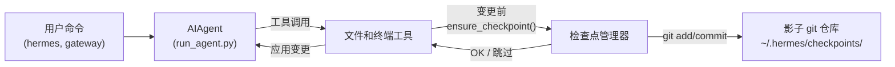

## 检查点和 `/rollback`

Hermes Agent 会在**破坏性操作**之前自动快照您的项目，并让您通过单个命令恢复。检查点**默认启用**——当没有文件变更工具触发时，零成本。

这个安全网由一个内部的**检查点管理器**驱动，它在 `~/.hermes/checkpoints/` 下维护一个单独的影子 git 仓库——您真实项目的 `.git` 永远不会被触碰。

## 什么会触发检查点

检查点在以下情况前自动创建：

- **文件工具** —— `write_file` 和 `patch`
- **破坏性终端命令** —— `rm`、`mv`、`sed -i`、`truncate`、`shred`、输出重定向 (`>`) 和 `git reset`/`clean`/`checkout`

代理每个目录每轮对话**最多创建一个检查点**，因此长时间运行的会话不会生成大量快照。

## 快速参考

| 命令 | 描述 |
|---------|-------------|
| `/rollback` | 列出所有检查点及变更统计 |
| `/rollback <N>` | 恢复到检查点 N（同时撤销最后一轮对话） |
| `/rollback diff <N>` | 预览检查点 N 与当前状态的差异 |
| `/rollback <N> <file>` | 从检查点 N 恢复单个文件 |

## 检查点如何工作

高层次来看：

- Hermes 检测工具何时将要**修改文件**在您的项目工作树中。
- 每个对话轮次（每个目录）一次，它会：
  - 解析文件的合理项目根目录。
  - 初始化或复用绑定到该目录的**影子 git 仓库**。
  - 使用简短、人类可读的原因暂存并提交当前状态。
- 这些提交形成检查点历史，您可以通过 `/rollback` 检查和恢复。



## 配置

检查点默认启用。在 `~/.hermes/config.yaml` 中配置：

```yaml
checkpoints:
  enabled: true          # 主开关（默认：true）
  max_snapshots: 50      # 每个目录的最大检查点数
```

禁用：

```yaml
checkpoints:
  enabled: false
```

禁用时，检查点管理器为无操作，不会尝试 git 操作。

## 列出检查点

从 CLI 会话中：

```
/rollback
```

Hermes 会回复格式化的列表，显示变更统计：

```text
📸 检查点列表 /path/to/project:

  1. 4270a8c  2026-03-16 04:36  在 patch 之前  (1 个文件, +1/-0)
  2. eaf4c1f  2026-03-16 04:35  在 write_file 之前
  3. b3f9d2e  2026-03-16 04:34  在 terminal: sed -i s/old/new/ config.py 之前  (1 个文件, +1/-1)

  /rollback <N>             恢复到检查点 N
  /rollback diff <N>        预览自检查点 N 以来的变更
  /rollback <N> <file>      从检查点 N 恢复单个文件
```

每个条目显示：

- 短哈希
- 时间戳
- 原因（触发快照的内容）
- 变更摘要（变更的文件、插入/删除）

## 使用 `/rollback diff` 预览变更

在恢复之前，预览自检查点以来发生了什么变更：

```
/rollback diff 1
```

这会显示 git diff 统计摘要，然后是实际的 diff：

```text
test.py | 2 +-
 1 file changed, 1 insertion(+), 1 deletion(-)

diff --git a/test.py b/test.py
--- a/test.py
+++ b/test.py
@@ -1 +1 @@
-print('original content')
+print('modified content')
```

长差异限制为 80 行，以避免淹没终端。

## 使用 `/rollback` 恢复

按编号恢复到检查点：

```
/rollback 1
```

在后台，Hermes：

1. 验证目标提交是否存在于影子仓库中。
2. 创建当前状态的**预回滚快照**，以便您可以稍后"撤销撤销"。
3. 恢复工作目录中的已跟踪文件。
4. **撤销最后一轮对话**，使代理的上下文与恢复的文件系统状态匹配。

成功时：

```text
✅ 恢复到检查点 4270a8c5: 在 patch 之前
已自动保存预回滚快照。
(^_^)b 撤销了 4 条消息。已移除："现在更新 test.py..."
  4 条消息保留在历史中。
  对话回合已撤销以匹配恢复的文件状态。
```

对话撤销确保代理不会"记住"已回滚的变更，避免下一轮产生混淆。

## 单文件恢复

仅从检查点恢复一个文件，而不会影响目录的其余部分：

```
/rollback 1 src/broken_file.py
```

当代理对多个文件进行了更改，但只有一个是需要恢复时，这很有用。

## 安全与性能保护

为了保持检查点的安全和快速，Hermes 应用了几个保护机制：

- **Git 可用性** —— 如果在 `PATH` 上找不到 `git`，检查点将透明禁用。
- **目录范围** —— Hermes 跳过过于宽泛的目录（根 `/`、主目录 `$HOME`）。
- **仓库大小** —— 超过 50,000 个文件的目录会被跳过，以避免缓慢的 git 操作。
- **无变更快照** —— 如果自上次快照以来没有变更，检查点将被跳过。
- **非致命错误** —— 检查点管理器中的所有错误都以调试级别记录；您的工具继续运行。

## 检查点存储位置

所有影子仓库位于：

```text
~/.hermes/checkpoints/
  ├── <hash1>/   # 一个工作目录的影子 git 仓库
  ├── <hash2>/
  └── ...
```

每个 `<hash>` 都是从工作目录的绝对路径派生。在每个影子仓库中，您会发现：

- 标准 git 内部文件（`HEAD`、`refs/`、`objects/`）
- 包含精选忽略列表的 `info/exclude` 文件
- 指向原始项目根目录的 `HERMES_WORKDIR` 文件

您通常永远不需要手动操作这些。

## 最佳实践

- **保持检查点启用** —— 默认启用，当没有文件被修改时零成本。
- **恢复前使用 `/rollback diff`** —— 预览将发生什么变更以选择正确的检查点。
- **想要撤销代理驱动的更改时使用 `/rollback`** 而不是 `git reset`。
- **与 Git 工作树结合**以获得最大安全性 —— 让每个 Hermes 会话在自己的工作树/分支中运行，检查点作为额外的安全层。

有关在同一仓库上并行运行多个代理，请参阅 [Git 工作树](./git-worktrees.md)指南。
